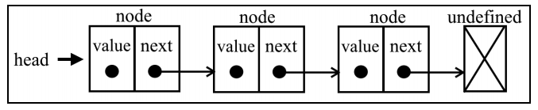
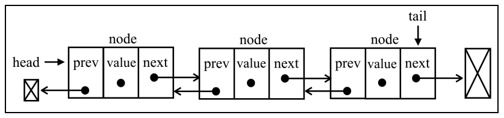

# 学习 JavaScript 数据结构与算法（第 3 版）

## 第 1 章　JavaScript 简介

讲述了 JavaScript 的基础知识。

### 相等运算符（== 和 ===）

使用`==`时，不同类型的值也可以被看作相等。下面的表格展示了不同类型的值用相等运算符比较后的结果。

 | 类型（ x） | 类型（ y） | 结 果               |
 | ---------- | ---------- | ------------------- |
 | null       | undefined  | true                |
 | undefined  | null       | true                |
 | 数         | 字符串     | x == toNumber(y)    |
 | 字符串     | 数         | toNumber(x) == y    |
 | 布尔值     | 任何类型   | toNumber(x) == y    |
 | 任何类型   | 布尔值     | x == toNumber(y)    |
 | 字符串或数 | 对象       | x == toPrimitive(y) |
 | 对象       | 字符串或数 | toPrimitive(x) == y |

如果 x 和 y 的类型相同， JavaScript 会用 equals 方法比较这两个值或对象。没有列在这个表格中的其他情况都会返回 false。

toNumber 和 toPrimitive 方法是内部的，并根据以下表格对其进行估值。toNumber 方法对不同类型返回的结果如下。

| 值 类 型  | 结 果                                                                                                                                 |
| --------- | ------------------------------------------------------------------------------------------------------------------------------------- |
| undefined | NaN                                                                                                                                   |
| null      | +0                                                                                                                                    |
| 布尔值    | 如果是 true，返回 1；如果是 false，返回+0                                                                                             |
| 数        | 数对应的值                                                                                                                            |
| 对象      | 如果对象的 valueOf 方法的结果是原始值，返回原始值；</br>如果对象的 toString 方法返回原始值，就返回这个值；</br>其他情况都返回一个错误 |

示例：

```js
console.log('packt' == true) // false

// 为什么输出是 false?
// 首先，布尔值会被 toNumber 方法转成数，因此得到 packt == 1。
// 其次，用 toNumber 转换字符串值。因为字符串包含字母，所以会被转成 NaN，
// 表达式就变成了 NaN == 1，结果就是 false。
```

那么`===`运算符呢？简单多了。如果比较的两个值类型不同，比较的结果就是 false。如果比较的两个值类型相同，结果会根据下表判断。

| 类型（ x） | 值                            | 结 果 |
| ---------- | ----------------------------- | ----- |
| 数         | x 和 y 的值相同（但不是 NaN） | true  |
| 字符串     | x 和 y 是相同的字符           | true  |
| 布尔值     | x 和 y 都是 true 或 false     | true  |
| 对象       | x 和 y 引用同一个对象         | true  |

## 第 2 章　ECMA Script 和 TypeScript 概述

没啥新鲜的，只是一个大概的介绍，略。

## 第 3 章　数组

介绍了如何使用数组这种最基础且最常用的数据结构。

数组存储一系列同一种数据类型的值。虽然在 JavaScript 里，也可以在数组中保存不同类型的值，但我们还是遵守最佳实践，避免这么做（大多数语言都没这个能力）。

紧接着介绍了数组常用的方法，也没啥好说的，略。

### ECMA Script 6 和数组的新功能

| 方 法      | 描 述                                                                      |
| ---------- | -------------------------------------------------------------------------- |
| @@iterator | 返回一个包含数组键值对的迭代器对象，可以通过同步调用得到数组元素的键值对   |
| copyWithin | 复制数组中一系列元素到同一数组指定的起始位置                               |
| entries    | 返回包含数组所有键值对的 @@iterator                                        |
| includes   | 如果数组中存在某个元素则返回 true，否则返回 false。 E2016 新增             |
| find       | 根据回调函数给定的条件从数组中查找元素，如果找到则返回该元素               |
| findIndex  | 根据回调函数给定的条件从数组中查找元素，如果找到则返回该元素在数组中的索引 |
| fill       | 用静态值填充数组                                                           |
| from       | 根据已有数组创建一个新数组                                                 |
| keys       | 返回包含数组所有索引的 @@iterator                                          |
| of         | 根据传入的参数创建一个新数组                                               |
| values     | 返回包含数组中所有值的 @@iterator                                          |

**for...of 语句**

for...of 可以用来迭代数组。

> 其实 for...of 还可以用来迭代 String、Set、Map、函数和 argument 对象，理论上说，他可以迭代任何可迭代的对象。
> 所谓**可迭代对象**，就是实现了 [可迭代协议](https://developer.mozilla.org/zh-CN/docs/Web/JavaScript/Reference/Iteration_protocols) 的对象。

**@@iterator 对象**

ES2015 还为 Array 类增加了一个 @@iterator 属性，需要通过 Symbol.iterator 来访问。

> @@iterator 属性同样可参考 [可迭代协议](https://developer.mozilla.org/zh-CN/docs/Web/JavaScript/Reference/Iteration_protocols) 部分。

```js
let iterator = numbers[Symbol.iterator]()
console.log(iterator.next().value) // 1
```

然后，不断调用迭代器的 next 方法，就能依次得到数组中的值。

**keys 方法**

keys 方法返回包含数组索引的 @@iterator，下面是使用该方法的代码示例。

```js
const aKeys = numbers.keys() // 得到数组索引的迭代器
console.log(aKeys.next()) // {value: 0, done: false }
```

### 类型数组（TypedArray）

与 C 和 Java 等其他语言不同， JavaScript 数组不是强类型的，因此它可以存储任意类型的数据。（最佳实践：存储同一类型的数据）

类型数组则用于存储单一类型的数据。它的语法是 let myArray = new TypedArray(length)，其中 TypedArray 需替换为下表所列之一。

| 类型数组          | 数据类型            |
| ----------------- | ------------------- |
| Int8Array         | 8 位二进制补码整数  |
| Uint8Array        | 8 位无符号整数      |
| Uint8ClampedArray | 8 位无符号整数      |
| Int16Array        | 16 位二进制补码整数 |
| Uint16Array       | 16 位无符号整数     |
| Int32Array        | 32 位二进制补码整数 |
| Uint32Array       | 32 位无符号整数     |
| Float32Array      | 32 位 IEEE 浮点数   |
| Float64Array      | 64 位 IEEE 浮点数   |

使用 WebGL API、进行位操作、处理文件和图像时，类型数组都可以大展拳脚。它用起来和普通数组毫无二致，本章所学的数组方法和功能都可以用于类型数组。

## 第 4 章　栈

栈是一种遵从后进先出（LIFO）原则的有序集合。新添加或待删除的元素都保存在栈的同一端，称作栈顶，另一端就叫栈底。在栈里，新元素都靠近栈顶，旧元素都接近栈底。

栈结构类似于数组，但是在添加和删除元素时更为可控。

**基于数组的栈**

```js
class Stack(){
  constructor () {
    this.items = []
  }
  //添加一个（或几个）新元素到栈顶
  push (element) { this.items.push(element) }
  //移除栈顶元素，并返回被移除的元素
  pop () { return this.items.pop() }
  //返回栈顶的元素，不对栈进行任何修改
  peek () { return this.items[this.items.length - 1] }
  //移除栈里的所有元素
  clear () { this.items = [] }
  //判断栈空，没有元素返回 true, 否则返回 false
  isEmpty () { return this.items.length === 0 }
  //返回栈里元素的个数
  size () { return this.items.length }
}
```

**基于对象的栈**

- 数组属于有序集合，会占用更多的内存空间；
- 数组中查找元素时，需要遍历所有元素，复杂度更高（O(n)）。

```js
class Stack {
  constructor () {
    this.count = 0
    this.items = {}
  }
  // 添加元素
  push (element) {
    this.items[this.count] = element
    this.count++
  }
  // 弹出元素
  pop () {
    if (this.isEmpty()) { return undefined }
    this.count--
    const result = this.items[this.count]
    delete this.items[this.count]
    return result
  }
  //返回栈顶的元素，不对栈进行任何修改
  peek () {
    if (this.isEmpty()) { return undefined }
    return this.items[this.count - 1]
  }
  // 移除所有元素
  clear () {
    this.items = {}
    this.count = 0
  }
  // 栈的大小
  size() { return this.count }
  // 栈是否为空
  isEmpty() { return this.count === 0 }

  // 打印栈的内容
  toString() {
    if (this.isEmpty()) { return '' }
    let objString = `${this.items[0]}`
    for (let i = 1; i < this.count; i++) {
      objString = `${objString},${this.items[i]}`
    }
    return objString
  }
}
```

存在的问题：我们在 Stack 类中声明的 items 和 count 属性并没有得到保护，不是私有属性。

解决方法：下划线约定、Symbol、WeakMap。

然而，事实上，我们不能像在其他编程语言中一样声明私有属性和方法。虽然有很多种方法都可以达到相同的效果，但无论是在语法还是性能层面，这些方法都有各自的优点和缺点。

### 栈结构常见的算法问题

TODO

## 第 5 章　队列和双端队列

- 队列和栈非常类似，但是使用了与后进先出不同的原则。
- 双端队列是一种将栈的原则和队列的原则混合在一起的数据结构。
- 队列是遵循先进先出（ FIFO，也称为先来先服务）原则的一组有序的项。队列在尾部添加新元素，并从顶部移除元素。最新添加的元素必须排在队列的末尾。

### 队列

可以使用数组来存储队列内的元素，但是为了在获取元素时更高效，我们还是会使用一个对象来存储我们的元素。

```js
class Queue {
  constructor () {
    this.items = {}        // 用来存储元素
    this.count = 0         // 用来控制队列大小
    this.firstCount = 0    // 用来追踪第一个元素
  }
  // 添加多个项到尾部
  enqueue (element) {
    this.items[this.count] = element
    this.count++
  }
  // 移除第一项，并返回元素
  dequeueue () {
    if (this.isEmpty()) { return undefined }
    const result = this.items[this.firstCount]
    delete this.items[this.firstCount]
    this.firstCount++
    return result
  }
  // 返回第一个元素，不改变队列
  peek () {
    if (this.isEmpty()) { return undefined }
    return this.items[this.firstCount]
  }
  // 返回队列元素个数
  size () { return this.count - this.firstCount }
  isEmpty () { return this.size() === 0 }
  // 清空队列
  clear() {
    this.items = {}
    this.count = 0
    this.firstCount = 0
  }
  toString() {
    if (this.isEmpty()) { return '' }
    let objString = `${this.items[this.firstCount]}`
    for (let i = this.firstCount + 1; i < this.count; i++) {
      objString = `${objString},${this.items[i]}`
    }
    return objString
  }
}
```

**队列应用 - 击鼓传花游戏**

- 游戏规则：孩子们围成一个圆圈，把花尽快地传递给旁边的人。某一时刻传花停止，这个时候花在谁手里，谁就退出圆圈、结束游戏。重复这个过程，直到只剩一个孩子（胜者）。

```js
function hotPotato (itemList, num) {
  const queue = new Queue()
  const eliminatedList = []

  for (let i = 0; i < itemList.length; i++) {
    queue.enqueue(itemList[i])
  }

  while (queue.size() > 1) {
    // 循环队列，打乱之前的顺序
    for (let i = 0; i < num; i++) {
      queue.enqueue(queue.dequeueue())
    }
    // 淘汰队列的第一个（队列顺序已乱，淘汰是随机的）
    eliminatedList.push(queue.dequeueue())
  }

  return {
    eliminated: eliminatedList,
    winner: queue.dequeueue()
  }
}
```

### 双端队列

- 允许同时从前端和后端添加和移除元素的特殊队列。
- 由于双端队列同时遵守了`先进先出`和`后进先出`原则，可以说它是把队列和栈相结合的一种数据结构。所以和 Queue、Stack 类有一些相同的方法。
- 常见应用是计算机中存储一系列的撤销操作：用户操作被保存到一个双端队列中，点击撤销按钮时，该操作从队列后面移除；当操作数量大于指定值时，则移除队列前端保存的的操作，保持队列的长度不会超出指定值。

```js
class Dequeue {
  constructor () {
    this.count = 0
    this.firstCount = 0
    this.items = {}
  }
  // 返回队列元素个数
  size () { return this.count - this.firstCount }
  isEmpty () { return this.size() === 0 }
  // 清空队列
  clear() {
    this.items = {}
    this.count = 0
    this.firstCount = 0
  }
  toString() {
    if (this.isEmpty()) { return '' }
    let objString = `${this.items[this.firstCount]}`
    for (let i = this.firstCount + 1; i < this.count; i++) {
      objString = `${objString},${this.items[i]}`
    }
    return objString
  }

  // 队列前端添加元素
  addFront (element) {
    if (this.isEmpty) {
      this.addBack(element)
    } else if (this.firstCount > 0) {
      this.firstCount--
      this.items[this.firstCount] = element
    } else {
      // firstCount = 0 的情况
      for (let i = this.count; i > 0; i--) {
        this.items[i] = this.items[i - 1]
      }
      this.count++
      this.firstCount = 0
      this.items[0] = element
    }
  }
  // 队列后端添加元素 - 与 Queue 类中的 enqueue 方法相同
  addBack (element) {
    this.items[this.count] = element
    this.count++
  }
  // 队列前端移除一个元素 - 与 Queue 类中的 dequeueue 方法相同
  removeFront () {
    if (this.isEmpty()) { return undefined }
    const result = this.items[this.firstCount]
    delete this.items[this.firstCount]
    this.firstCount++
    return result
  }
  // 队列后端移除一个元素 - 与 Stack 类中的 pop 方法相同
  removeBack () {
    if (this.isEmpty()) { return undefined }
    this.count--
    const result = this.items[this.count]
    delete this.items[this.count]
    return result
  }
  // 返回队列前端的第一个元素 - 与 Queue 类中的 peek 方法相同
  peekFront () {
    if (this.isEmpty()) { return undefined }
    return this.items[this.firstCount]
  }
  // 返回队列后端的第一个元素 - 与 Stack 中的 peek 方法相同
  peekBack () {
    if (this.isEmpty()) { return undefined }
    return this.items[this.count - 1]
  }
}
```

在 Dequeue 类中，最复杂的是 addFront 方法，分三种情况：

1. 队列为空时直接添加即可；
2. 已经调用过 removeFront 方法，此时 firstCount > 0，此时只需 firstCount - 1 然后添加即可；
3. 未调用过 removeFront 方法，firstCount 为 0。此时先设置一个负值的键，这样可以保持很低的计算成本，然后我们将所有元素后移一位空出第一个位置。注意我们是从最后一位开始迭代。

**双端队列应用 - 回文检查器**

> 回文：正反都能读通的单词、词组、数或一系列字符的序列，例如 madam 或 racecar。

```js
function palindromeChecker (str) {
  if (str === undefined || str === null || (str !== null && str.length === 0)) {
    return false
  }

  const strArr = str.toLocalLowerCase().split(' ').join('').split('')
  const dequeue = new Dequeue()
  let isEqual = true
  let firstItem, lastItem
  for (const item of strArr) {
    dequeue.addBack(item)
  }

  while (dequeue.size() > 1 && isEqual) {
    firstItem = dequeue.removeFront()
    lastItem = dequeue.removeBack()
    if (firstItem !== lastItem) {
      isEqual = false
    }
  }

  return isEqual
}
```

## 第 6 章　链表

- 链表和数组一样都是有序的元素集合；
- 数组的缺点：
  - 数组存储必须使用连续的物理空间，那么在数据量较大或者系统空间碎片较多时不易存储；
  - 数组的大小是固定的，从数组的起点或中间插入或移除项的成本很高，因为需要移动元素。

### 单向链表/普通链表



```js
// 辅助函数 - 比较是否相等
function defaultEquals (a, b) {
  return a === b
}

// 辅助类 - 表示想要添加到链表中的项
class Node {
  constructor (element) {
    this.element = element
    this.next = undefined
  }
}

class LinkedList {
  constructor (equalsFn = defaultEquals) {
    this.count = 0 // 元素数量
    this.head = undefined // 指向第一个元素
    this.equalsFn = equalsFn
  }

  // 向列表尾部添加一个新元素
  push (element) {
    const node = new Node(element)
    let current
    // 链表中没有元素时，head 直接指向 node
    if (this.head === null) {
      this.head = node
    } else {
      // 链表中已有元素时，需要先找到最后一个元素
      // current 用来指向最后一个元素
      current = this.head
      while (current.next !== null) {
        current = current.next
      }
      current.next = node
    }
    this.count++
  }
  // 返回链表中特定位置的元素
  getElementAt (index) {
    if (index >= 0 && index <= this.count) {
      let node = this.head
      for (let i = 0; i < index && node !== null; i++) {
        node = node.next
      }
      return node
    }
    return undefined
  }
  // 向链表指定位置插入一个元素
  insert (element, position) {
    if (index >= 0 && index <= this.count) {
      const node = new Node(element)
      if (index === 0) {
        const current = this.head
        node.next = current
        this.head = node
      } else {
        const previous = this.getElementAt(index - 1)
        node.next = previous.next
        previous.next = node
      }
      this.count++
      return true
    }
    return false
  }
  // 返回元素在链表中的索引
  indexOf (element) {
    let current = this.head;
    for (let i = 0; i < this.size() && current !== null i++) {
      if (this.equalsFn(element, current.element)) {
        return i
      }
      current = current.next
    }
    return -1
  }
  // 从链表中移除一个元素
  remove (element) {
    const index = this.indexOf(element)
    return this.removeAt(index)
  }
  // 从链表的特定位置移除一个元素
  removeAt (index) {
    if (index >= 0 && index < this.count) {
      let current = this.head
      // 移除第一项
      if (index === 0) {
        this.head = current.next
      } else {
        let previous
        for (let i = 0; i < index; i++) {
          previous = current
          current = current.next
        }
        // 将 previous 与 current 的下一项链接起来：跳过 current，从而移除它
        previous.next = current.next
      }
      this.count--
      return current.element
    }
    return undefined
  }

  // 链表是否为空
  isEmpty () {
    return this.size() === 0
  }
  // 链表包含的元素个数
  size () {
    return this.count
  }
  getHead() {
    return this.head
  }
  // 返回表示整个链表的字符串
  toString () {
    if (this.head == null) {
      return ''
    }
    let objString = `${this.head.element}`
    let current = this.head.next
    for (let i = 1; i < this.size() && current != null; i++) {
      objString = `${objString},${current.element}`
      current = current.next
    }
    return objString
  }
}
```

### 双向链表

双向链表和普通链表的区别在于，在普通链表中，一个节点只有链向下一个节点的链接；而在双向链表中，链接是双向的：一个链向下一个元素，另一个链向前一个元素。



```js
import { defaultEquals } from '../util';
import LinkedList from './linked-list';
import { DoublyNode } from './models/linked-list-models'

// DoublyLinkedList 类是一种特殊的 LinkedList 类，我们只需要扩展 LinkedList 类即可。
class DoublyLinkedList extends LinkedList {
  constructor(equalsFn = defaultEquals) {
    super(equalsFn)
    this.tail = undefined
  }

  push(element) {
    const node = new DoublyNode(element)
    if (this.head == null) {
      this.head = node
      this.tail = node // NEW
    } else {
      // attach to the tail node // NEW
      this.tail.next = node
      node.prev = this.tail
      this.tail = node
    }
    this.count++
  }

  insert(element, index) {
    if (index >= 0 && index <= this.count) {
      const node = new DoublyNode(element)
      let current = this.head
      if (index === 0) {
        if (this.head == null) { // NEW
          this.head = node
          this.tail = node // NEW
        } else {
          node.next = this.head
          this.head.prev = node // NEW
          this.head = node
        }
      } else if (index === this.count) { // last item NEW
        current = this.tail
        current.next = node
        node.prev = current
        this.tail = node
      } else {
        const previous = this.getElementAt(index - 1)
        current = previous.next
        node.next = current
        previous.next = node
        current.prev = node // NEW
        node.prev = previous // NEW
      }
      this.count++
      return true
    }
    return false
  }

  removeAt(index) {
    if (index >= 0 && index < this.count) {
      let current = this.head
      if (index === 0) {
        this.head = this.head.next
        // if there is only one item, then we update tail as well //NEW
        if (this.count === 1) {
          // {2}
          this.tail = undefined
        } else {
          this.head.prev = undefined
        }
      } else if (index === this.count - 1) {
        // last item //NEW
        current = this.tail
        this.tail = current.prev
        this.tail.next = undefined
      } else {
        current = this.getElementAt(index)
        const previous = current.prev
        // link previous with current's next - skip it to remove
        previous.next = current.next
        current.next.prev = previous // NEW
      }
      this.count--
      return current.element
    }
    return undefined
  }

  indexOf(element) {
    let current = this.head
    let index = 0
    while (current != null) {
      if (this.equalsFn(element, current.element)) {
        return index
      }
      index++
      current = current.next
    }
    return -1
  }

  getHead() {
    return this.head
  }

  getTail() {
    return this.tail
  }

  clear() {
    super.clear()
    this.tail = undefined
  }

  toString() {
    if (this.head == null) {
      return ''
    }
    let objString = `${this.head.element}`
    let current = this.head.next
    while (current != null) {
      objString = `${objString},${current.element}`
      current = current.next
    }
    return objString
  }

  inverseToString() {
    if (this.tail == null) {
      return ''
    }
    let objString = `${this.tail.element}`
    let previous = this.tail.prev
    while (previous != null) {
      objString = `${objString},${previous.element}`
      previous = previous.prev
    }
    return objString
  }
}
```

### 循环链表

### 有序链表

## 第 7 章　集合
## 第 8 章　字典和散列表
## 第 9 章　递归
## 第 10 章　树
## 第 11 章　二叉堆和堆排序
## 第 12 章　图
## 第 13 章　排序和搜索算法
## 第 14 章　算法设计与技巧
## 第 15 章　算法复杂度