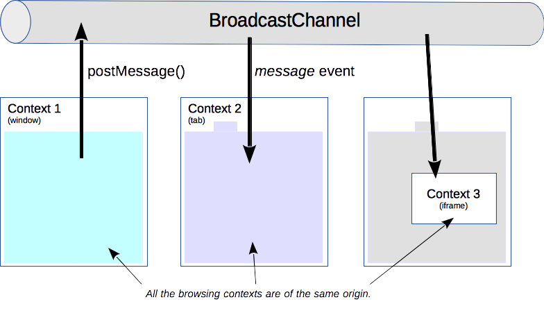
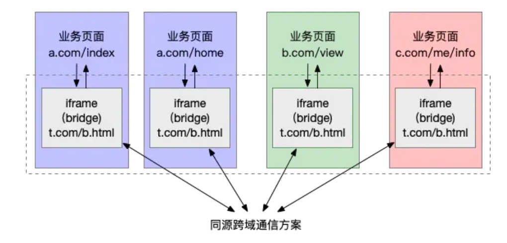

## 跨页面通信

在浏览器中，我们可以同时打开多个 Tab 页，每个 Tab 页可以粗略理解为一个“独立”的运行环境，即使是全局对象也不会在多个 Tab 间共享。然而有些时候，我们希望能在这些“独立”的 Tab 页面之间同步页面的数据、信息或状态。

**同源** tab 间的通信主要有以下几种方法：

- 广播模式：一个页面将消息通知给一个“中央站”，再由“中央站”通知给各个页面。
  - BroadcastChannel
  - Service Worker
  - LocalStorage + StorageEvent
- 共享存储模式：共享存储+轮询
  - Shared Worker
  - IndexedDB
  - cookie
- window
  - window.open + window.opener
- 基于服务端
  - Websocket
  - Comet
  - SSE

### BroadCastChannel

顾名思义，BroadcastChannel 用来创建一个广播频道（中央站），页面发生改变时通知频道，频道通知其他页面。



```js
// 创建频道
// 注意传入的参数 name，相同 name 的频道才能通信
const bc = new BroadcastChannel('channel')

// 监听事件
bc.onmessage = function (e) {
    const data = e.data
    const text = `msg: ${data.msg}; from: ${data.from}`
    console.log(text)
}

// 发送消息
const data = 'send msg!'
bc.postMessage(data)

// 频道关闭
bc.close()
```

兼容性：仅支持现代浏览器，不支持 IE。

### LocalStorage

当 LocalStorage 变化时，会触发 [storage](https://developer.mozilla.org/zh-CN/docs/Web/API/StorageEvent) 事件。利用这个特性，我们可以在发送消息时，把消息写入到 LocalStorage 中；然后在各个页面内，通过监听 storage 事件即可收到通知。

```js
// 监听 storage 事件
// StorageEvent 会在 window 对象上发布
window.addEventListener('storage', function (e) {
  if (e.key === 'test') {
    const data = JSON.parse(e.newValue)
    const text = `msg: ${data.msg}; from: ${data.from}`
    console.log(text)
  }
})

// 数据存入 LocalStorage
// storage 事件只有在值真正改变时才会触发，所以加个时间戳
const data = {}
data.st = +(new Date)
window.localStorage.setItem('test', JSON.stringify(data))
```

### Service Worker

Service Worker 是一个可以长期运行在后台的 Worker，能够实现与页面的双向通信。多页面共享间的 Service Worker 可以共享，将 Service Worker 作为消息的处理中心（中央站）即可实现广播效果。

### Shared Worker

Shared Worker 是 Worker 家族的另一个成员。普通的 Worker 之间是独立运行、数据互不相通；而多个 Tab 注册的 Shared Worker 则可以实现数据共享。

Shared Worker 在实现跨页面通信时的问题在于，它无法主动通知所有页面，因此，我们会使用轮询的方式，来拉取最新的数据。思路如下：

- 让 Shared Worker 支持两种消息
- post，Shared Worker 收到后会将该数据保存下来；
- get，Shared Worker 收到该消息后会将保存的数据通过 postMessage 传给注册它的页面。也就是让页面通过 get 来主动获取（同步）最新消息。

### Index DB

除了 Shared Worker 之外，一些支持跨页面的存储方案也是可以类似的方法，比如 Index DB 和 Cookie。由于 Cookie 本身的目的并不是存储，所以我们不在使用它，而是使用更为专业的 Index DB 实现。

实现思路与 Shared Worker 方案类似，发送方将消息存至 IndexedDB 中；接收方（例如所有页面）则通过轮询去获取最新的信息。

:::tip
也许你会认为长轮询没有监听模式优雅，但实际上，有些时候使用“共享存储”的形式时，不一定要搭配长轮询。

例如，在多 Tab 场景下，我们可能会离开 Tab A 到另一个 Tab B 中操作；过了一会我们从 B 切换回 A 时，希望将之前在 B 中的操作的信息同步回来。这时候，其实只用在 A 中监听 visibilityChange 这样的事件，来做一次信息同步即可。
:::

### postMessage

使用 window.open 打开页面时，方法会返回一个被打开页面 window 的引用。而在未显示指定 noopener 时，被打开的页面可以通过 window.opener 获取到打开它的页面的引用 —— 通过这种方式我们就将这些页面建立起了联系（一种树形结构）。

- 前提：postMessage 是绑定在 window 对象上的，因此通信的页面中必须有一个页面可以获取另一个页面的 window 对象。
- 问题：如果页面不是通过 window.open 打开的（例如直接在地址栏输入，或从其他网站链接过来），这个联系就被打破了。

```js
// A 页面
window.addEventListener('message', receiveMessage, false)

function receiveMessage (e) {
  // 安全起见，必须判断域名
  const { data, origin } = e
  if (origin !== 'http://example.org:8080') return
  console.log(data)
}
```

```js
// B 页面
// 安全起见，必须指定域名
window.postMessage('data', 'http://example.org:8080')
```

### 服务端

除以上方法之外，还可以使用 Polling/COMET/SSE/WebSocket 等服务端推送的方式实现 tab 间通信。思路相当于将“中央站”由前端转移到了后端。

### 非同源页面间通信

要实现该功能，可以使用一个用户不可见的 iframe 作为“桥”。由于 iframe 与父页面间可以通过指定 origin 来忽略同源限制，因此可以在每个页面中嵌入一个 iframe，而这些 iframe 由于使用的是一个 url，因此属于同源页面，其通信方式可以复用前面提到的各种方式。

一个前提：要有所有 tab 的页面修改权限。



```js
// 页面 A
window.addEventListener('message', function (e) {
  // …… do something
})

const origin = 'xxx'
window.frames[0].window.postMessage('data', origin);
```

```js
// iframe A
const url = 'xxx'
const bc = new BroadcastChannel('chanel')
// 收到来自页面的消息后，在 iframe 间进行广播
window.addEventListener('message', function (e) {
  const { data, origin } = e
  if (origin !== url) return
  bc.postMessage(data)
});    
```

```js
// iframe B，将信息传递给 B 页面
const originB
bc.onmessage = function (e) {
  window.parent.postMessage(e.data, originB)
}
```

## TODO

- [What happens when...](https://github.com/skyline75489/what-happens-when-zh_CN)

## 参考

- [前端跨页面通信 - 掘金](https://juejin.cn/post/6844903811232825357)
