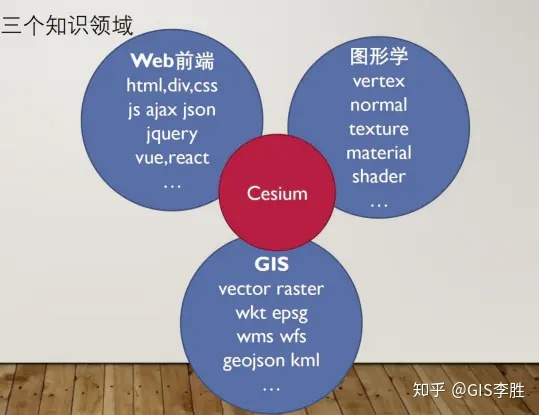

## Cesium

Cesium 是一个 web 端的三维地图开发框架，涉及三个知识领域 : Web 前端、计算机图形学、地理信息系统（GIS）。

## 功能简介

- 开发基础
	- 核心类
	- 坐标系统
	- 入口类
	- 相机
- 数据
	- 影像、底图（Imagery）
	- 地形（Terrain）
	- 矢量数据（指定区域的 geojson 数据）
	- Graphics（空间数据可视化，添加图形、多面体）
	- 三维模型：3D Tiles、giTF
- 空间分析
	- 测量工具
	- 切割面编辑器
	- 可视域分析
- 交互查询
	- EventHandler
	- 拾取：pick、DrillPick
- 要素展示
	- 加载地形
	- 加载瓦片服务
	- 加载矢量数据
	- 几何实体
	- 加载三维模型
	- 时间系统与 CZML
	- 粒子系统

## API 分类

- Viewer 类属性
  - imageryLayers 影像数据
  - terrainProvider 地形数据
  - dataSources 矢量数据
  - entities 几何实体集合（用于空间数据可视化）
  - Widgets 组件，即 Viewer 初始化界面上的组件
  - Camera 相机
  - Event 事件，鼠标事件、实体选中事件等
- Scene 类属性
  - primitives 图元集合（几何体和外观）
  - postProcessStages 场景后期处理
  - 环境对象，大气圈、天空盒、太阳、月亮等
  - Event 事件，更新、渲染事件等
  - Camera 类属性
  - 位置、方位角、俯仰角、翻滚角
- 空间计算
  - 三维矩阵、四元数、四维矩阵、转换等

## 参考

- [Cesium 开发基础 - 知乎李胜](https://www.zhihu.com/column/c_1317874447190585344)