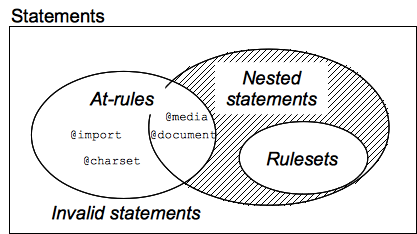

本文主要说明 CSS 中的一些关键概念。

## 语言语法和形式

CSS 的基本目标是让浏览器以指定的特性去绘制页面元素，比如颜色，定位，装饰。CSS 的语法由下面两个部分构建：

- 属性（ property）是一个标识符，用可读的名称来表示其特性。
- 值（value）则描述了浏览器引擎如何处理该特性。每个属性都包含一个有效值的集合，它有正式的语法和语义定义，被浏览器引擎实现。 

**声明（declaration）**

```css
/* 冒号左侧是属性，右侧是值。 */
color: red;
```

**声明块（declaration block）**

```css
/* 声明块（declaration block） */
{
  color: red;
  text-align: center;
}
```

**规则（ruleset）**

```css
/* 一对选择器（selector）与声明块称为规则集（ruleset），常简称为规则（rule） */
div p {
  color: red;
  text-align: center;
}
```
一个元素可能被多个选择器选中，因此会有多个规则，有可能以不同的值去设置同一属性。CSS 标准会规定哪个优先级最高并生效，称之为 **层叠（cascade）** 算法。

**语句（statement）**

有时候网页的作者也希望在样式表中包括其他的一些信息，比如字符集，导入其它的外部样式表，字体等，这些需要专门的语句表示。

语句以非空格的字符开头，以第一个反花括号或分号结束。

```css
@charset "UTF-8";
@import 'font.css';
```

**语句类型：**

- 规则。如上，将一组 CSS 声明与用选择器定义的条件相关联。
- at 规则（at-rules）。以@ （U+0040 COMMERCIAL AT） 开始，随后是标识符，一直到以分号或右大括号结束。每个 at 规则由其标识符定义，可能有它自己的语法。at 规则涵盖了 meta 信息（比如 @charset  @import），条件信息（比如@media  @document）, 描述信息（比如@font-face）。



更多 At-Rules 信息请参考：[At-Rules](./atRules)

## 优先级、继承、级联

### 优先级

下面列表中，选择器类型的优先级是**递增**的：

- 标签选择器（例如，h1）和伪元素（例如，::before）
- 类选择器 （例如，.example），属性选择器（例如，[type="radio"]）和伪类（例如，:hover）
- ID 选择器（例如，#example）
- 行内样式
- `!important`关键字

通配选择符（\*）关系选择符（+, >, ~, ' ', ||）和 否定伪类（:not(））对优先级没有影响。（但是，在 :not(） 内部声明的选择器会影响优先级）。

### 伪类、伪元素

- **伪类**

添加到选择器的关键字，指定要选择的元素的**特殊状态**。

一个选择器中只能使用一个伪元素，使用单冒号`:`。

```css
/* 用户指针悬停在按钮上时，color 为蓝色 */
/* 用户指针悬停，是按钮的特殊状态 */
button:hover {
  color: blue;
}

/* p 元素作为第一个子元素时，color 为蓝色 */
/* 作为第一个子元素，是 p 元素的特殊状态 */
p:first-child {
  color: blue;
}
```

> 附：a 标签伪类顺序
> - `link` 用户未访问的 a 标签，而且鼠标没有悬停在其上
> - `visited` 已被访问过的 a 标签
> - `hover` 鼠标悬停在其上的 a 标签
> - `active` 用户正在点击的 a 标签

- **伪元素**

附加至选择器末的关键词，允许你对被选择元素的**特定部分**修改样式。

使用双冒号`::`。

```css
/* p 元素的第一行显示为蓝色 */
/* 第一行，是 p 元素的特定部分 */
p::first-line {
  color: blue;
}
```

## 流式布局

float、position

## 弹性布局

## 元素类型

## 盒模型

## 层叠

## Text

## Background、Border

## 媒体查询

## 动画

### BFC、IFC、GFC、FFC

**BFC（Block formatting contexts）：块级格式上下文**

一个独立的渲染区域，只有块级元素参与， 内部的 Box 会在垂直方向依次放置，并且这个区域与外部毫不相干，margin 不会重叠。

```
// 如何生成：
- 根元素
- float 属性不为 none
- position 为 absolute 或 fixed
- display 为 inline-block, table-cell, table-caption, flex, inline-flex
- overflow 不为 visible
```

**IFC（Inline formatting contexts）：内联格式上下文**

**GFC（GrideLayout formatting contexts）：网格布局格式化上下文**

**FFC（Flex formatting contexts）: 自适应格式上下文**

### CSS 渲染原理

1. 解析源文档并创建文档树。
2. 识别目标媒体类型。
3. 检索文档相关特定目标媒体类型的所有样式表
4. 通过给每个适用于目标媒体类型的属性赋值来为文档树中的元素做标注。根据层叠与继承中描述的机制来对属性赋值
  值的计算部分取决于适用于目标媒体类型的格式化算法。例如，如果目标媒体是 screen，用户代理会应用视觉格式化模型
5. 根据有标注的文档树，生成格式化结构。通常，格式化结构与文档树很像，但也可能大不一样，尤其是编写者使用伪元素和生成的内容时。首先，格式化结构根本没必要是“树形的”——结构的类型取决于实现。其次，与文档树相比，格式化结构包含的信息可能更多也可能更少。例如，如果文档树中的一个元素有一个值为'none'的'display'属性，这个元素将不会在格式化结构中生成任何东西。而一个列表元素可能在格式化结构中生成更多信息：列表元素的内容和列表样式信息（例如，黑点图片）
  注意 CSS 用户代理不会在这个阶段改变文档树，特别的，由样式表生成的内容生成不会被反馈给文档语言处理器（例如，重新解析）
6. 把格式化结构传递给目标媒体（例如，打印结果，在屏幕上显示，渲染为声音等等）

> [The CSS 2.1 processing model](https://www.w3.org/TR/CSS2/intro.html)

[CSS 渲染原理以及优化策略](https://segmentfault.com/a/1190000021073560)
