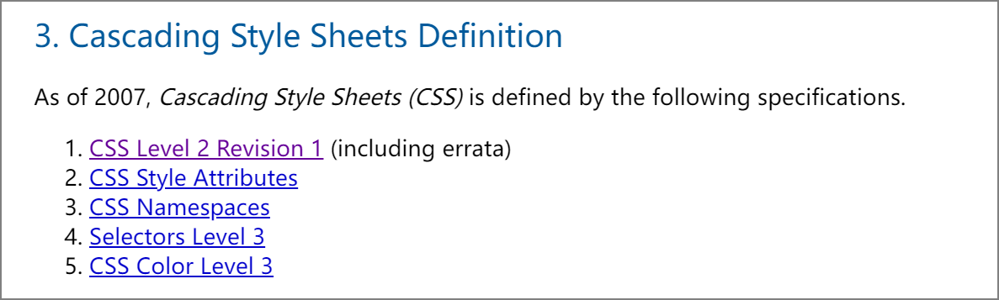

## W3C 标准审核流程

W3C 推荐的每个标准都会经历以下五个阶段：

1. 首次发布的工作草案（FPWD，First Public Working Draft）
2. 修订版工作草案（WD，Working Draft）
3. 候选推荐（CR，Candidate Recommendation）
4. 提议推荐（PR，Proposed Recommendation）
5. 推荐标准（REC，Recommendation）

其中候选推荐（CR）阶段，标准文档还可能发生进一步的修改，但此时重大的特性大部分已经锁定。

## CSS 历史

按照 CSS 工作组的说法，CSS 历史上并没有版本的概念，有的只是“级别”([level](https://www.w3.org/TR/CSS/#css-levels)) 的概念。

CSS 规范，最开始是 CSS level 1，后来迭代到 CSS level 2。但是在更新 CSS2 的时候 W3C 还没有规定上面的五个流程，就导致 CSS2 Bug 很多，后期进行了很多勘误，特别乱，于是工作组迭代了一版 CSS 2.1 修订版（CSS Level 2 Revision 1），主要做了以下工作：

- 保持 CSS2 中那些已经被广泛接受和实现的部分的兼容性
- 结合所有已经发布的 CSS2 勘误
- 对于与 CSS2 规范差异很大的实现，修改规范以适应已经被普遍接受的做法
- 移除 CSS2 中那些因为没有被实现而被 CSS 社区拒绝的特性，CSS 2.1 旨在反映那些在 HTML 和 XML 语言中被广泛实现的合理特性（不单单是对 XML 语言，或者 HTML）
- 移除 CSS2 中将被 CSS3 废弃的特性，因此鼓励采用 CSS3 中提出的特性
- 当实现经验表明 CSS2 需要实现（新特性）时，添加少量的新属性值

后来，随着 CSS 特性越来越多，越来越复杂，CSS 规范的篇幅也越来越长。这就给勘误和进一步升级带来了极大不便。因为文档不同部分升级的进度不可能强求一致。于是，CSS 工作组决定从 CSS 2.1 之后开始采取模块化的路线，每个单独勘误和升级。

**这里要注意，各模块单独升级并不是指把 CSS 2.1 拆掉了，而是在 2.1 的基础上作补充**。每次更新的时候，W3c 会发表一篇文章 (Snapshot)，里面会有对 CSS 组成的官方定义，会标明完整的 CSS 规范由哪几篇文档组成，也就是 **完整的 CSS 规范 = CSS 2.1 + n 篇其他规范**，其他规范里会写明替换或修改了 2.1 中的哪个部分。

上面截图为 2007 的 Snapshot，标明完整的 CSS 由五篇文档定义！之后的几次更新，文档越来越多。

| 年份 | 文档数量      |
| ---- | ------------- |
| 2007 | 5 😃           |
| 2010 | 6 😃           |
| 2015 | 24 😲          |
| 2017 | 32 😢          |
| 2018 | 20+5+11=36  😭 |
| 2020 | 23+14+6=43  😑 |
| 2021 | 24+13+15=52 🙃 |

能看到 CSS 发展的如此壮大，真好🙃

W3c 也很贴心，怕你不知道其他的文章，每次你去看 CSS 2.1 规范时，就会温馨提示你：

:::danger
Note: Several sections of this specification have been updated by other specifications. Please, see "Cascading Style Sheets (CSS) — The Official Definition" in the latest CSS Snapshot for a list of specifications and the sections they replace.

注意：本规范的几个部分已被其他规范更新。请参阅最新 CSS 快照中的“级联样式表 (CSS) — 官方定义”以获取规范列表及其替换的部分。
:::

CSS 采取模块化路线后，就有了三种模块，而且它们的命名方式非常值得注意。

- CSS Level 2 原有模块：比如 Selector、Color 等这些都是从原来 CSS 规范中拆出来的模块。这些模块的命名一开始就会从 Level 3 开始，因为它们都是在 CSS Level 2 的基础之上开始的。
- 新模块：CSS Level 2 中不存在类似特性的都将作为新增的模块出现，因此它们的命名会从 Level 1 开始。
- 当然，还有在制定 CSS 2.1 时从 CSS2 中删除的内容。而其中大部分内容都会在 CSS Level 3 中重新制定，一旦它们进入 CR 阶段，就会取代之前对应的内容成为新标准。

## 现在的 CSS 规范

[W3c 最新的 Snapshot 文章](https://www.w3.org/TR/css-2021/#css) 是 2021 年发布的，标明完整的 CSS 由 CSS 2.1 和其他的 **51** 个规范组成。

CSS 2.1 主要定义了以下内容：

- 语法和基本数据类型 (Syntax and basic data types)
- 选择器 (Selectors)
- 分配属性值、级联和继承 (Assigning property values, Cascading, and Inheritance)
- 媒体类型 (Media types)
- 盒模型 (Box model)
- 视觉格式化模型 (Visual formatting model)
- 视觉格式化模型细节 (Visual formatting model details)
- 视觉效果 (Visual effects)
- 生成内容、自动编号和列表 (Generated content, automatic numbering, and lists)
- 分页媒体 (Paged media)
- 颜色和背景 (Colors and Backgrounds)
- 字体 (Fonts)
- 文字 (Text)
- 表格 (Tables)
- 用户界面 (User interface)

其他规范定义了哪些内容？todo 🙃

## 参考

- [w3.org - rec-track](https://www.w3.org/2021/Process-20211102/#rec-track)
- [w3.org - CSS/current-work](https://www.w3.org/Style/CSS/current-work)
- [w3.org - CSS snapshot](https://www.w3.org/TR/css-2017/)
- [MDN - CSS](https://developer.mozilla.org/zh-CN/docs/Web/CSS)
- [掘金 - 众成翻译](https://juejin.cn/post/6844903625353854989)
- [w3.org - 中文](http://www.ayqy.net/doc/css2-1/cover.html)
