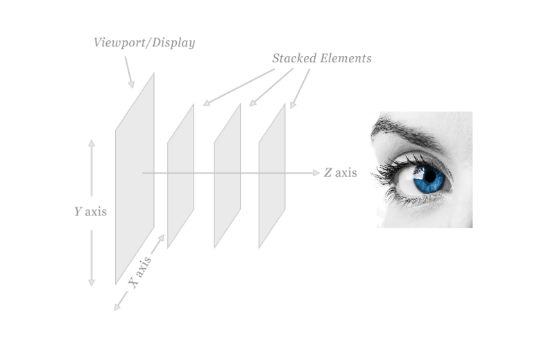
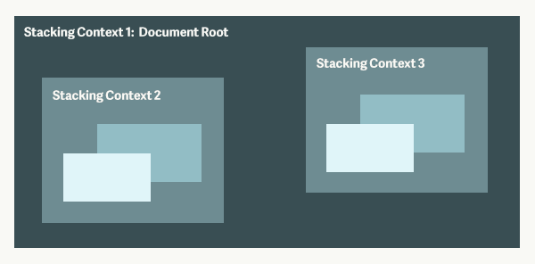
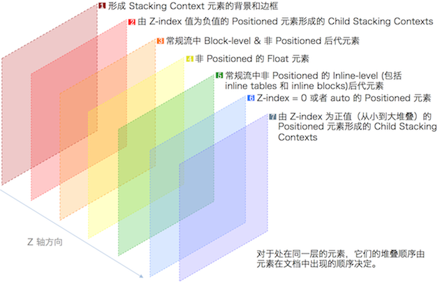

屏幕是一个二维平面，然而 HTML 元素却是排列在三维坐标系中，x 为水平位置，y 为垂直位置，z 为屏幕**由内向外**方向的位置，我们在看屏幕的时候是沿着 z 轴方向从外向内的；由此，元素在用户视角就形成了层叠的关系，某个元素可能覆盖了其他元素也可能被其他元素覆盖；

那么这里有几个重要的概念：

- **层叠上下文** （堆叠上下文，Stacking Context）、
- **层叠等级** （层叠水平，Stacking Level）、
- **层叠顺序** （层叠次序/堆叠顺序，Stacking Order）、
- **z-index**

声明：

1.  `以下定位元素`指的是`position: absolute|fixed|relative|sticky`
2.  `以下非定位元素`指的是`position: initial|static`
3.  关于层叠上下文还有一个类似的概念：**块级格式化上下文** (BFC, Block Formatting Context)，可以参考一下 [CSS 中重要的 BFC](https://segmentfault.com/a/1190000013023485)，其中还介绍了一些文档流的内容；
4.  本文蛮长的，但是如果你有勇气看完，那应该对层叠有关概念就基本掌握了 (～o￣▽￣)～

## 层叠上下文 (Stacking Context)

**层叠上下文** （堆叠上下文，Stacking Context)，是 HTML 中一个三维的概念。在 CSS2.1 规范中，每个元素的位置是三维的，当元素发生层叠，这时它可能覆盖了其他元素或者被其他元素覆盖；排在 z 轴越靠上的位置，距离屏幕观察者越近

文章 [<关于 z-index 那些你不知道的事>](https://webdesign.tutsplus.com/zh-hans/articles/what-you-may-not-know-about-the-z-index-property--webdesign-16892) 有一个很好的比喻，这里引用一下；

可以想象一张桌子，上面有一堆物品，这张桌子就代表着一个层叠上下文。 如果在第一张桌子旁还有第二张桌子，那第二张桌子就代表着另一个层叠上下文。

现在想象在第一张桌子上有四个小方块，他们都直接放在桌子上。 在这四个小方块之上有一片玻璃，而在玻璃片上有一盘水果。 这些方块、玻璃片、水果盘，各自都代表着层叠上下文中一个不同的层叠层，而这个层叠上下文就是桌子。

每一个网页都有一个默认的层叠上下文。 这个层叠上下文（桌子）的根源就是`<html></html>`。 html 标签中的一切都被置于这个默认的层叠上下文的一个层叠层上（物品放在桌子上）。

当你给一个定位元素赋予了除 `auto` 外的 z-index 值时，你就创建了一个新的层叠上下文，其中有着独立于页面上其他层叠上下文和层叠层的层叠层， 这就相当于你把另一张桌子带到了房间里。

层叠上下文 1 (Stacking Context 1) 是由文档根元素形成的， 层叠上下文 2 和 3 (Stacking Context 2, 3) 都是层叠上下文 1 (Stacking Context 1) 上的层叠层。 他们各自也都形成了新的层叠上下文，其中包含着新的层叠层。

在层叠上下文中，其子元素按照上面解释的规则进行层叠。形成层叠上下文的 [方法](https://developer.mozilla.org/en-US/docs/Web/CSS/CSS_Positioning/Understanding_z_index/The_stacking_context) 有：

*   根元素`<html></html>`
*   `position`值为`absolute | relative`，且`z-index`值不为 `auto`
*   `position` 值为 `fixed | sticky`
*   `z-index` 值不为 `auto` 的 flex 元素，即：父元素`display: flex | inline-flex`
*   `opacity` 属性值小于 `1` 的元素
*   `transform` 属性值不为 `none`的元素
*   `mix-blend-mode` 属性值不为 `normal` 的元素
*   `filter`、`perspective`、`clip-path`、`mask`、`mask-image`、`mask-border`、`motion-path` 值不为 `none` 的元素
*   `perspective` 值不为 `none` 的元素
*   `isolation` 属性被设置为 `isolate` 的元素
*   `will-change` 中指定了任意 CSS 属性，即便你没有直接指定这些属性的值
*   `-webkit-overflow-scrolling` 属性被设置 `touch`的元素

总结：
1.  层叠上下文可以包含在其他层叠上下文中，并且一起组建了一个有层级的层叠上下文
2.  每个层叠上下文完全独立于它的兄弟元素，当处理层叠时只考虑子元素，这里类似于 [BFC](https://segmentfault.com/a/1190000013023485)
3.  每个层叠上下文是自包含的：当元素的内容发生层叠后，整个该元素将会**在父级层叠上下文**中按顺序进行层叠

## 层叠等级 (Stacking Level)

**层叠等级** （层叠水平，Stacking Level) 决定了同一个层叠上下文中元素在 z 轴上的显示顺序的**概念**；

*   普通元素的层叠等级优先由其所在的层叠上下文决定
*   层叠等级的比较只有在同一个层叠上下文元素中才有意义
*   在同一个层叠上下文中，层叠等级描述定义的是该层叠上下文中的元素在 Z 轴上的上下顺序

:::warning 注意！
层叠等级并不一定由 z-index 决定，只有定位元素的层叠等级才由 z-index 决定，其他类型元素的层叠等级由层叠顺序、他们在 HTML 中出现的顺序、他们的父级以上元素的层叠等级一同决定，详细的规则见下面层叠顺序的介绍。
:::

## z-index

> 在 CSS 2.1 中，所有的盒模型元素都处于三维坐标系中。 除了我们常用的横坐标和纵坐标， 盒模型元素还可以沿着"z 轴"层叠摆放， 当他们相互覆盖时， z 轴顺序就变得十分重要。
> 
> -- [CSS 2.1 Section 9.9.1 - Layered presentation](http://www.w3.org/TR/CSS21/visuren.html#z-index)

z-index 只适用于定位的元素，对非定位元素无效，它可以被设置为正整数、负整数、0、auto，如果一个定位元素没有设置 z-index，那么默认为 auto；

值得注意的是，**元素的 z-index 值只在同一个层叠上下文中有意义**。如果父级层叠上下文的层叠等级低于另一个层叠上下文的，那么它 z-index 设的再高也没用。所以如果你遇到 z-index 值设了很大，但是不起作用的话，就去看看它的父级层叠上下文是否被其他层叠上下文盖住了。

## 层叠顺序 (Stacking Order)

**层叠顺序** （层叠次序，堆叠顺序，Stacking Order) 描述的是元素在同一个层叠上下文中的顺序**规则**，从层叠的底部开始，共有七种层叠顺序：

1.  **背景和边框**：形成层叠上下文的元素的背景和边框。
2.  **负 z-index 值**：层叠上下文内有着负 z-index 值的定位子元素，负的越大层叠等级越低；
3.  **块级盒**：文档流中块级、非定位子元素；
4.  **浮动盒**：非定位浮动元素；
5.  **行内盒**：文档流中行内、非定位子元素；
6.  **z-index: 0**：z-index 为 0 或 auto 的定位元素， 这些元素形成了新的层叠上下文；
7.  **正 z-index 值**：z-index 为正的定位元素，正的越大层叠等级越高；

同一个层叠顺序的元素按照在 HTML 里出现的顺序层叠；第 7 级顺序的元素会显示在之前顺序元素的上方，也就是看起来覆盖了更低级的元素：

## 实战

### 普通情况

三个`relative`定位的`div`块中各有`absolute`的不同颜色的`span.red`、`span.green`、`span.blue`，它们都设置了`position: absolute`；

[参见 Codepen - 普通情况](https://codepen.io/SHERlocked93/pen/aaPord)

那么当没有元素包含 z-index 属性时，这个例子中的元素按照如下顺序层叠（从底到顶顺序）：

1.  根元素的背景和边界
2.  块级非定位元素按 HTML 中的出现顺序层叠
3.  行内非定位元素按 HTML 中的出现顺序层叠
4.  定位元素按 HTML 中的出现顺序层叠

红绿蓝都属于 z-index 为 auto 的定位元素，因此按照 7 层层叠顺序规则来说同属于层叠顺序第 6 级，所以按 HTML 中的出现顺序层叠：`红->绿->蓝`

### 在相同层叠上下文的父元素内的情况

红绿位于一个`div.first-box`下，蓝位于`div.second-box`下，红绿蓝都设置了`position: absolute`，`first-box`与`second-box`都设置了`position: relative`；

[参见 Codepen - 父元素不同但都位于根元素下](https://codepen.io/SHERlocked93/pen/RYENBw)

这个例子中，红蓝绿元素的父元素`first-box`与`second-box`都没有生成新的层叠上下文，都属于根层叠上下文中的元素，且都是层叠顺序第 6 级，所以按 HTML 中的出现顺序层叠：`红->绿->蓝`

### 给子元素增加 z-index

红绿位于一个`div.first-box`下，蓝黄位于`div.second-box`下，红绿蓝都设置了`position: absolute`，如果这时给绿加一个属性`z-index: 1`，那么此时`.green`位于最上面；

如果再在`.second-box`下`.green`后加一个绝对定位的 `span.gold`，设置`z-index: -1`，那么它将位于红绿蓝的下面；

[参见 Codepen - 设置了 z-index](https://codepen.io/SHERlocked93/pen/gdZOrK)

这个例子中，红蓝绿黄元素的父元素中都没有生成新的层叠上下文，都属于根层叠上下文中的元素

1.  红蓝都没有设置 z-index，同属于层叠顺序中的第 6 级，按 HTML 中的出现顺序层叠；
2.  绿设置了正的 z-index，属于第 7 级；
3.  黄设置了负的 z-index，属于第 2 级；

所以这个例子中的从底到高显示的顺序就是：`黄->红->蓝->绿`

### 在不同层叠上下文的父元素内的情况

红绿位于一个`div.first-box`下，蓝位于`div.second-box`下，红绿蓝都设置了`position: absolute`，如果`first-box`的 z-index 设置的比`second-box`的大，那么此时无论蓝的 z-index 设置的多大`z-index: 999`，蓝都位于红绿的下面；如果我们只更改红绿的 z-index 值，由于这两个元素都在父元素`first-box`产生的层叠上下文中，此时谁的 z-index 值大，谁在上面；

[参见 Codepen - 不同层叠上下文的父元素](https://codepen.io/SHERlocked93/pen/gdZbOJ)

这个例子中，红绿蓝都属于设置了 z-index 的定位元素，不过他们的父元素创建了新的层叠上下文；

1.  红绿的父元素`first-box`是设置了正 z-index 的定位元素，因此创建了一个层叠上下文，属于层叠顺序中的第 7 级；
2.  蓝的父元素`second-box`也同样创建了一个层叠上下文，属于层叠顺序中的第 6 级；
3.  按照层叠顺序，`first-box`中所有元素都排在`second-box`上；
4.  红绿都属于层叠上下文`first-box`中且设置了不同的正 z-index，都属于层叠顺序中第 7 级；
5.  蓝属于层叠上下文`second-box`，且设置了一个很大的正 z-index，属于层叠元素中第 7 级；
6.  虽然蓝的 z-index 很大，但是因为`second-box`的层叠等级比`first-box`小，因此位于红绿之下；

所以这个例子中从低到到显示的顺序：`蓝->红->绿`

（我遇到的的情况就属于这个例子类似情形）

### 给子元素设置 opacity

红绿位于`div.first-box`下，蓝位于`div.second-box`下，红绿蓝都设置了`position: absolute`，绿设置了`z-index: 1`，那么此时绿位于红蓝的最上面；

如果此时给`first-box`设置`opacity: .99`，这时无论红绿的 z-index 设置的多大`z-index: 999`，蓝都位于红绿的上面；

如果再在`.second-box`下`.green`后加一个`span.gold`，设置`z-index: -1`，那么它将位于红绿蓝的下面；

[参见 Codepen - opacity 的影响](https://codepen.io/SHERlocked93/pen/GXPRWB)

之前已经介绍了，设置`opacity`也可以形成层叠上下文，因此：

1.  `first-box`设置了`opacity`，`first-box`成为了一个新的层叠上下文；
2.  `second-box`没有形成新的层叠上下文，因此其中的元素都属于根层叠上下文；
3.  黄属于层叠顺序中第 2 级，红绿属于第 7 级，`first-box`属于第 6 级，蓝属于层叠顺序中第 6 级且按 HTML 出现顺序位于`first-box`之上；

所以这个例子中从低到到显示的顺序：`黄->红->绿->蓝`

## 参考

1.  [你不知道的 Z-Index](https://www.w3ctrain.com/2015/07/19/what-no-one-told-you-about-z-index/)
2.  [MDN - z-index](https://developer.mozilla.org/en-US/docs/Web/CSS/z-index)
3.  [What No One Told You About Z-Index](https://philipwalton.com/articles/what-no-one-told-you-about-z-index/)
4.  [彻底搞懂 CSS 层叠上下文、层叠等级、层叠顺序、z-index](https://segmentfault.com/a/1190000016207606)
5.  [前端性能优化之更平滑的动画](https://www.w3ctrain.com/2015/12/15/smoother-animation/)
6.  [关于 z-index 那些你不知道的事](https://webdesign.tutsplus.com/zh-hans/articles/what-you-may-not-know-about-the-z-index-property--webdesign-16892)
7.  [聊聊 CSS 中的层叠相关概念](https://www.w3cplus.com/css/understand-css-stacking-context-order-z-index.html)
8. [CSS 中重要的 BFC](https://segmentfault.com/a/1190000013023485)

---

文章出处：[segmentfault](https://segmentfault.com/a/1190000016489078)