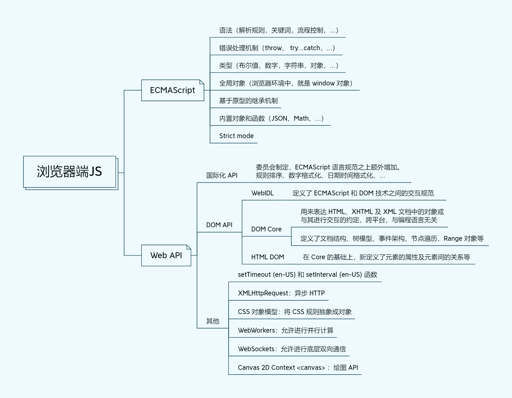

## 浏览器端 JS

- ECMAScript
- Web API
  - DOM（文档）
  - XMLHTTPRequest（网络）
  - Canvas、WebGL（图形）
  - Audio、Video（音视频）
  - localstorage、sessionStorage（存储）
  - Window
  - Navigator
  - History
  - Location
  - ......

《JavaScript 高级程序设计》第四版将浏览器端 JavaScript 概括为 ECMAscript + DOM + BOM，而 MDN 网站现已将 JavaScript 概括为 ECMAScript + Web API，其中 DOM 属于 Web API 中的一员，而 BOM 则被打散在了 Web API 中。

> 但是，如果从浏览器的范畴去理解“JavaScript”这个术语，它包含了截然不同的两个方面。一方面是 JavaScript 的核心语言（ECMAScript），另一方面是大量的 Web API 们，包括 DOM（文档对象模型）。 —— [JavaScript 技术概览 - MDN](https://developer.mozilla.org/zh-CN/docs/Web/JavaScript/JavaScript_technologies_overview)

## Nodejs

客户端 JS 的相同之处：都使用 ECMAScript 作为基本语法；

不同之处：因为 Nodejs 是服务端，所以客户端 JS 中的那些 Web APIS 是无法使用的，但是 nodejs 中定义了自己在 server 端特有的 API，例如 http fs Stream os 等。
