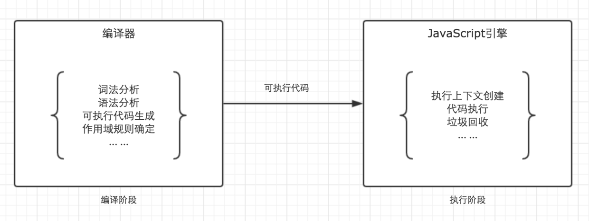

简单地讲，可以分为两个阶段：编译阶段、执行阶段。



## 编译阶段

### 词法分析 (Scanner)

将由字符组成的字符串分解成（对编程语言来说）有意义的代码块，这些代码块被称为词法单元 (token)。

```json
[
  {"type": "Keyword","value": "var"},
  {"type": "Identifier","value": "name"},
  {"type": "Punctuator","value": "="},
  {"type": "String","value": "'finget'"},
  {"type": "Punctuator","value": ";"}
]
```

### 语法分析 (Parser)

这个过程是将词法单元流（数组）转换成一个由元素逐级嵌套所组成的代表了程序语法结构的树。这个树被称为“抽象语法树”(Abstract Syntax Tree，AST)。

```json
{
  "type": "Program",
  "body": [
    {
      "type": "VariableDeclaration",
      "declarations": [
        {
          "type": "VariableDeclarator",
          "id": {
            "type": "Identifier",
            "name": "name"
          },
          "init": {
            "type": "Literal",
            "value": "finget",
            "raw": "'finget'"
          }
        }
      ],
      "kind": "var"
    }
  ],
  "sourceType": "script"
}
```

### 作用域

作用域是一套规则，用来管理引擎如何查找变量。JS 采用是词法作用域 (lexical scoping)，也就是静态作用域，函数的作用域在函数定义的时候就决定了。

> 与之对应的还有一个动态作用域，函数的作用域是在函数调用的时候才决定的

参考：[How javascript works](https://github.com/Troland/how-javascript-works) 

## 执行阶段

### 执行上下文

JavaScript 中的运行环境有三种。

- 全局环境：JavaScript 代码运行起来会首先进入该环境；
- 函数环境：当函数被调用执行时，会进入当前函数中执行代码；
- eval（不建议使用，可忽略）。

JS 引擎会以函数调用栈 (call stack) 的方式处理代码，遇到以上三种情况，都会分别生成不同类型的执行上下文，并推入调用栈中。所以 JavaScript 中有三种执行上下文类型：

- 全局执行上下文 （只有一个）
- 函数执行上下文
- eval（不常用，不做讨论）

执行上下文可以分为两个阶段：**创建阶段**和**执行阶段**。

### 上下文创建阶段

创建阶段做了两件事：

- LexicalEnvironment（词法环境） 组件被创建。
- VariableEnvironment（变量环境） 组件被创建。

```js
// 伪代码
ExecutionContext = {
  LexicalEnvironment = { ... },   // 词法环境
  VariableEnvironment = { ... },  // 变量环境
}
```

#### 词法环境（Lexical Environment）

词法环境是 ECMA 中的一个规范类型 —— 基于代码词法嵌套结构用来记录标识符和具体变量或函数的关联。 简单来说，词法环境就是建立了**标识符 - 变量**的映射表。这里的标识符指的是变量名称或函数名，而变量则是实际变量原始值或者对象/函数的引用地址。

在词法环境中，有三个组成部分：

1. 环境记录 (environment record)：存储变量和函数声明的实际位置。
2. 对外部环境的引用 (outer environment reference)：意味着它可以访问其外部词法环境，用以实现作用域链。
3. this 绑定 (This Binding)：确定当前环境中 this 的指向；

由于执行上下文有两种类型（全局和函数），所以词法环境也有两种：

- 全局词法环境：
  - 包含定义了的全局变量；
  - 对外部环境的引用指向 null；
  - 拥有全局对象 window，且 this 指向 window；
- 函数词法环境：
  - 包含在函数中定义的变量；
  - 对外部环境的引用指向生成这个词法的父环境；
  - this 的指向调用时确定；
  - 有一个 arguments 对象，包含了传给函数的参数。

#### 变量环境 Variable Environment

变量环境是一种特定类型的词法环境，词法环境的属性和特点他都有！

在 ES6 前，声明变量都是通过 var 关键词，在 ES6 中则提倡使用 let 和 const，为了兼容 var 的写法，于是使用变量环境来存储 var 声明的变量。

变量环境本质上仍是词法环境，但它只存储 var 声明的变量，这样在初始化变量时可以赋值为 undefined。let、const 生命的变量则会被保持为 uninitialized（未初始化状态）。

#### 例子

```js
let a = 10;
const b = 20;
var sum;

function add(e, f){
    var d = 40;
    return d + e + f 
}

let utils = {
    add
}

sum = utils.add(a, b)
```

```
// 执行上下文 - 创建阶段 （伪代码）

// 全局上下文
GlobalExecutionContext = {
  LexicalEnvironment: {
    EnvironmentRecord: {
      type: 'object',
      add: <function>,
      a: <uninitialized>,
      b: <uninitialized>,
      utils: <uninitialized>,
    },
    outer: null,
    this: <globalObject>
  },
  VariableEnvironment: {
    EnvironmentRecord: {
      type: 'object',
      sum: undefined
    },
    outer: null,
    this: <globalObject>
  },
}

// 当运行到函数 add 时创建函数执行上下文
FunctionExecutionContext = {
  LexicalEnvironment: {
    EnvironmentRecord: {
      type: 'declarative',
      arguments: { 0: 10, 1: 20, length: 2 },
      [[ThisValue]]: <utils>,
      [[NewTarget]]: undefined,
      ...
    },
    outer: <GlobalLexicalEnvironment>, // outer 指向的是当前词法环境被定义时的父环境
    this: <utils>
  },
  VariableEnvironment: {
    EnvironmentRecord: {
      type: 'declarative',
      d: undefined
    },
    outer: <GlobalLexicalEnvironment>,
    this: <utils>
  },
}
```

#### 与 ES3 的区别

如果你了解 ES5 版本的有关执行上下文的内容，会感到奇怪为啥有关 VO、AO、作用域、作用域链等内容没有在本文中提及。其实两者概念并不冲突，一个是 ES3 规范中的定义，而词法环境则是 ES6 规范的定义。不同时期，不同称呼。

- ES3     -->   ES6
- 作用域   -->  词法环境
- 作用域链 --> outer 引用
- VO/AO   -->  环境记录

参考：[stackoverflow](https://stackoverflow.com/questions/12599965/lexical-environment-and-function-scope)

### 上下文执行阶段

在此阶段，完成了对所有这些变量的分配，并最终执行了代码。

1. 赋值
2. 词法环境用于解析绑定
  - 词法环境：最初，它只是环境变量的一个副本，在运行的上下文中，它用于确定出现在上下文中的标识符的绑定
  - 在执行阶段之后，借助词法环境，变量环境表被赋值（填充）
    - 每个执行上下文都有用于标识符解析的词法环境。上下文的所有本地绑定都存储于环境记录表中。如果在当前环境记录中没有解析标识符，解析过程将继续道外部（父）环境记录表。此模式将继续，直到标识符被解析位置。如果没有找到，抛出 ReferenceError。
    - 这与原型查找链非常相似。现在这里要记住的关键是词法环境在上下文创建（静态地）从词汇上捕获外部绑定，并在运行上下文（执行阶段）中使用。即词法环境是根据代码的位置来决定的，词法作用域是代码阶段就决定好的，和函数是怎么调用的没有关系。
    - 在创建阶段的所有函数都静态地（从词汇上）捕获其父环境的外部绑定。这允许嵌套函数访问外部绑定，即使父上下文已从执行堆栈中清除。这种机制是 JavaScript 中闭包的基础。

还是刚才的例子：

```diff
// 执行上下文 - 执行阶段 （伪代码）

// 全局上下文
GlobalExecutionContext = {
  LexicalEnvironment: {
    EnvironmentRecord: {
      type: 'object',
      add: <function>,
+     a: 20,
+     b: 30,
+     utils: < func >,
    },
    outer: null,
    this: <globalObject>
  },
  VariableEnvironment: {
    EnvironmentRecord: {
      type: 'object',
      sum: undefined
    },
    outer: null,
    this: <globalObject>
  },
}

// 当运行到函数 add 时创建函数执行上下文
FunctionExecutionContext = {
  LexicalEnvironment: {
    EnvironmentRecord: {
      type: 'declarative',
      arguments: { 0: 10, 1: 20, length: 2 },
      [[ThisValue]]: <utils>,
      [[NewTarget]]: undefined,
      ...
    },
    outer: <GlobalLexicalEnvironment>, // outer 指向的是词法环境被定义时的上下文
    this: <utils>
  },
  VariableEnvironment: {
    EnvironmentRecord: {
      type: 'declarative',
+     d: 20
    },
    outer: <GlobalLexicalEnvironment>,
    this: <utils>
  },
}
```

函数完成后，返回值存储在 sum 中。因此，全局词法环境已更新。之后，全局代码完成，程序结束。

## 参考

- [ECMA 262](https://262.ecma-international.org/10.0/#sec-executable-code-and-execution-contexts)
- [Understanding Execution Context and Execution Stack in Javascript](https://blog.bitsrc.io/understanding-execution-context-and-execution-stack-in-javascript-1c9ea8642dd0)
- [理解 Javascript 中的执行上下文和执行栈](https://segmentfault.com/a/1190000021774110)
- [JS 夯实之执行上下文与词法环境](https://juejin.cn/post/6844904145372053511)
- [前端基础进阶](https://segmentfault.com/a/1190000012646195)
