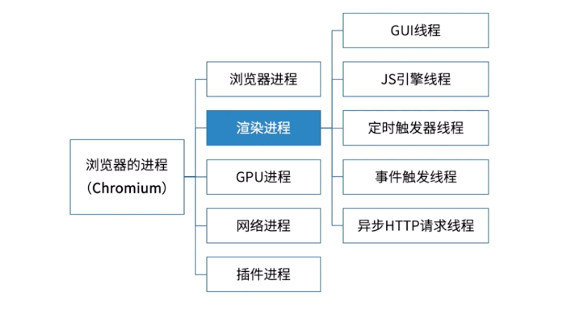
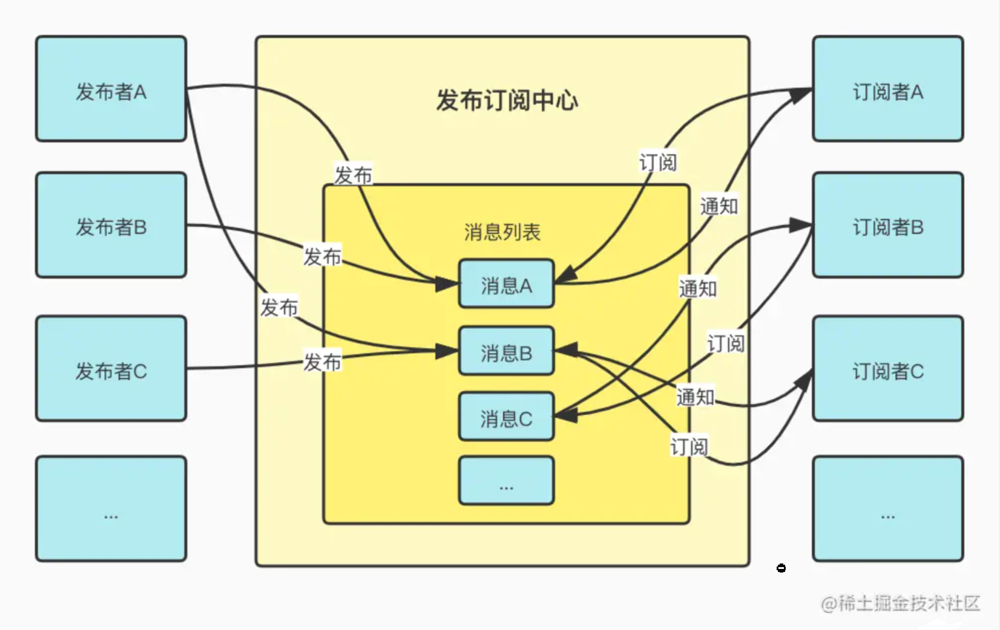

## 进程与线程

计算机的核心是 CPU，它承担了所有的计算任务。它就像一座工厂，时刻在运行。

进程就好比工厂的车间，它代表 CPU 所能处理的单个任务。任一时刻，CPU 总是运行一个进程，其他进程处于非运行状态。

一个车间里，可以有很多工人。他们协同完成一个任务。线程就好比车间里的工人。**一个进程可以包括多个线程**。

操作系统的设计，因此可以归结为三点：

- 以多进程形式，允许多个任务同时运行；
- 以多线程形式，允许单个任务分成不同的部分运行；
- 提供协调机制，一方面防止进程之间和线程之间产生冲突，另一方面允许进程之间和线程之间共享资源。

## 理解异步

**同步**：主线程上排队执行的任务，只有前面的任务执行完，才能执行后面的任务。
**异步**：是指不进入主线程，而是进入任务队列的任务，只有任务队列通知主线程，某个任务可以执行了，该任务才会进入主线程执行。

### 单线程的 js 如何实现异步？

通过浏览器的内核多线程实现异步。



- **GUI 线程**：负责渲染页面，解析 html、css；构建 DOM 树和渲染树；
- **js 引擎线程**： 负责解析和执行 js 程序，我们经常听到的 chrome 的 v8 引擎就是跑在 js 引擎线程上的，js 引擎线程只有一个，所有说 js 的单线程语言的原因，那其实语言没有单线程多线程之说，因为解释这个语言的是 的线程是单线程；js 引擎线程与 gui 线程互斥，当浏览器执行 javaScript 程序的时候，GUI 渲染线层会保存在一个队列当中；直到 js 程序执行完成，才会接着执行；如果 js 的执行时间过长，会影响页面的渲染不连贯，所有我们要尽量控制 js 的大小；
- **定时触发线程**：为什么 setTimeout 不阻塞后面程序的运行，那其实 setTimeout 不是由 js 引擎线程完成的，是由定时器触发线程完成的，所以它们可以是同时进行的，那么定时器触发线程在这定时任务完成之后会通知事件触发线程往任务队列里添加事件；
- **事件触发线程**：将满足触发条件的事件放入任务队列，一些异步的事件会放到异步队列中；
- **异步 HTTP 请求线程**：用与处理 ajax 请求的，当请求完成时如果有回调函数就通知事件触发线程往任务队列中添加任务；

## 事件循环（Event Loop）

JS 中有两种任务类型：微任务（microtask）和宏任务（macrotask），在 ES6 中，微任务称为 jobs，宏任务称为 task：

- **宏任务**：script （主代码块）、setTimeout 、setInterval 、setImmediate 、I/O 、UI rendering
- **微任务**：process.nextTick（Nodejs） 、Promise 、Object.observe 、MutationObserver


- [stackoverflow](https://stackoverflow.com/questions/25915634/difference-between-microtask-and-macrotask-within-an-event-loop-context)

- Node.js 中 Event Loop 和浏览器中 Event Loop 有什么区别？

## 异步编程方法

同步：连续的执行一段代码；
异步：任务被分成两段，先执行第一段，然后执行其他任务，等做好准备了再执行第二段。

### 回调

所谓回调函数，就是把任务的第二段单独写在一个函数里面，等到重新执行这个任务的时候，就直接调用这个函数。回调函数的英语名字 callback，直译过来就是"重新调用"。

```js
function ajax(url, callback) {
  // ...
}
ajax('./test1.json', function(data) {
  console.log(data)
  ajax('./test2.json', function(data) {
    console.log(data)
    ajax('./test3.json', function(data) {
      console.log(data)
    })
  })
})
```

回调函数本身没问题，问题在于会出现多个回调嵌套的局面（回调地狱）。代码不再是纵向发展，而是横向发展，很乱，耦合性很高。

### 事件监听

参考 [事件](../webApis/event) 一章。

### 发布订阅模式

原理：构建一个消息中心，B 函数向中心订阅了 A 函数执行成功的消息，A 函数执行成功后向中心发布消息，中心接到消息后通知 B 函数。

发布订阅模式是 promise 之前的一个主流的解决请求高耦合的方案。



```js
// 发布订阅应用
function ajax(url, callback) {
  // 实现省略
}

const pbb = new PubSub()
ajax('./test1.json', function(data) {
  pbb.publish('test1Success', data) // 发布
})
pbb.subscribe('test1Success', function(data) { // 订阅
  console.log(data)
  ajax('./test2.json', function(data) {
    pbb.publish('test2Success', data)
  })
})
pbb.subscribe('test2Success', function(data) {
  console.log(data)
  ajax('./test3.json', function(data) {
    pbb.publish('test3Success', data)
  })
})
pbb.subscribe('test2Success', function(data) {
  console.log(data)
})
```

发布和订阅类的实现

```js
class PubSub {
  constructor() {
    this.events = {} // 事件对象
  }
  // 发出一个事件
  publish(eventName, data) {
    if (this.events[eventName]) {
      this.events[eventName].forEach(cb => {
        cb.apply(this, data)
      })
    }
  }
  // 订阅一个事件
  subscribe(eventName, callback) {
    if (this.events[eventName]) {
      this.events[eventName].push(callback)
    } else {
      this.events[eventName] = [callback]
    }
  }
  // 取消订阅一个事件
  unSubscribe(eventName, callback) {
    if (this.events[eventName]) {
      this.events[eventName] = this.events[eventName].filter(
        cb => cb !== callback
      )
    }
  }
}
```

优点：松耦合；灵活（多次去订阅一个事件）。

缺点：无法确保消息被触发或者触发几次。

### Promise、async/await

重点难点，单独开篇 —— [Promise](./promise.md)。

## 参考

- [进程与线程 - 阮一峰](https://www.ruanyifeng.com/blog/2013/04/processes_and_threads.html)
- [ECMAScript6 入门 - 阮一峰](https://es6.ruanyifeng.com)
- [Promise A+ 规范（译）](http://malcolmyu.github.io/malnote/2015/06/12/Promises-A-Plus/)
- [Tasks, microtasks, queues and schedules](https://jakearchibald.com/2015/tasks-microtasks-queues-and-schedules/)
- [Web 全栈体系](https://hejialianghe.gitee.io/jsadvanced/asyncpro.html)
- [理解【观察者模式】和【发布订阅】的区别](https://juejin.cn/post/6978728619782701087)