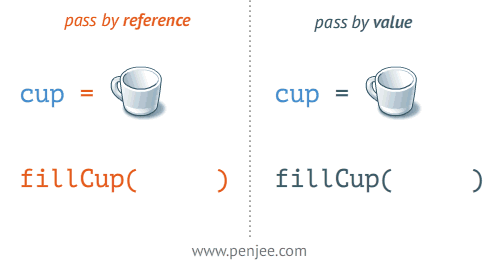

## 数据类型分类

JavaScript 共有八种数据类型，分别是 Undefined、Null、Boolean、Number、String、Object、Symbol、BigInt。

其中 Symbol 和 BigInt 是 ES6 中新增的数据类型：

- Symbol 代表创建后独一无二且不可变的数据类型，它主要是为了解决可能出现的全局变量冲突的问题。
- BigInt 是一种数字类型的数据，它可以表示任意精度格式的整数，使用 BigInt 可以安全地存储和操作大整数，即使这个数已经超出了 Number 能够表示的安全整数范围（2^53 - 1）。

这些数据可以分为原始数据类型和引用数据类型：

- 原始数据类型：String、Number、Boolean、Undefined、Null、Symbol、BigInt
- 引用数据类型：Object、Array、Function

在内存中的存储位置：

- 原始数据类型直接存储在栈 (stack) 中的简单数据段，占据空间小、大小固定，容易被频繁使用，所以放入栈中存储；
- 引用数据类型存储在堆 (heap) 中的对象，占据空间大、大小不固定，如果存储在栈中，将会影响程序运行的性能；但是引用数据类型在栈中存储了指针，该指针指向堆中该实体的真实地址，当解释器寻找引用值时，会首先检索其在栈中的地址，取得地址后从堆中获得实体。

## 为什么会有 BigInt 类型

JavaScript 中 Number.MAX_SAFE_INTEGER 表示最大安全数字，计算结果是 9007199254740991, 即在这个数范围内不会出现精度丢失 （小数除外） 但是一旦超过这个范围，js 就会出现计算不准确的情况，这在大数计算的时候不得不依靠 些第三方库进行解决，因此官方提出了 BigInt 来解决此问题。

## 复制值

除了存储方式不同，原始值和引用值在通过变量复制时也有所不同。

- 在通过变量把一个原始值赋值到另一个变量时，原始值会被复制到新变量的位置。这两个变量可以独立使用，互不干扰。
- 在把引用值从一个变量赋给另一个变量时，存储在变量中的值也会被复制到新变量所在的位置。区别在于，这里复制的值实际上是一个指针，它指向存储在堆内存中的对象。操作完成后，两个变量实际上指向同一个对象。（浅拷贝）



如果想完全的复制一个对象，就需要使用`深拷贝`方法，深拷贝会创建一个新的对象，两个对象属性完全相同，但是对应内存中的两个不同的地址，修改一个对象的属性，不会影响另一个对象。

实现深拷贝的方法：

- JSON.parse(JSON.stringify())
  - 缺点：JSON 在执行字符串化的这个过程时，会先进行一个 JSON 格式化，获得安全的 JSON 值，因此如果是非安全的 JSON 值，就会被丢弃掉。其中 undefined、function、symbol 这三种类型的值就是非安全的。且 set、map 这种数据格式的对象，会被处理成一个空对象。
- lodash.cloneDeep()
- jQuery.extend()
- 手写递归循环

```js
// 手写示例
function deepClone(obj, hash = new WeakMap()) {
  if (obj === null) return obj; // 如果是 null 或者 undefined 我就不进行拷贝操作
  if (obj instanceof Date) return new Date(obj);
  if (obj instanceof RegExp) return new RegExp(obj);
  // 可能是对象或者普通的值  如果是函数的话是不需要深拷贝
  if (typeof obj !== "object") return obj;
  // 是对象的话就要进行深拷贝
  if (hash.get(obj)) return hash.get(obj);
  let cloneObj = new obj.constructor();
  // 找到的是所属类原型上的 constructor, 而原型上的 constructor 指向的是当前类本身
  hash.set(obj, cloneObj);
  for (let key in obj) {
    if (obj.hasOwnProperty(key)) {
      // 实现一个递归拷贝
      cloneObj[key] = deepClone(obj[key], hash);
    }
  }
  return cloneObj;
}
```

## 数据类型检测方式

1. **typeof 操作符**

原始类型和 function 可正常检测，数组 对象 null 都会被判断为 object。

2. **instanceof**

可正确检测引用数据类型。原理是判断右侧的原型对象是否出现在左侧的原型链上。

```js
console.log(2 instanceof Number);                    // false
console.log(true instanceof Boolean);                // false 
console.log('str' instanceof String);                // false 
 
console.log([] instanceof Array);                    // true
console.log(function(){} instanceof Function);       // true
console.log({} instanceof Object);                   // true
```

3. **constructor**

```js
console.log((2).constructor === Number); // true
console.log((true).constructor === Boolean); // true
```

需要注意的是，如果修改了对象的原型对象，constructor 就不能用来判断数据类型了。

```js
function Fn(){};
 
Fn.prototype = new Array();
 
const f = new Fn();
 
console.log(f.constructor===Fn);    // false
console.log(f.constructor===Array); // true
```

4. **Object.prototype.toString.call()**

```js
const tos = Object.prototype.toString;
 
console.log(tos.call(2)); // [object Number]
console.log(tos.call(true)); // [object Boolean]
console.log(tos.call('str')); // [object String]
console.log(tos.call([])); // [object Array]
console.log(tos.call(function(){})); // [object Function]
console.log(tos.call({})); // [object Object]
console.log(tos.call(undefined)); // [object Undefined]
console.log(tos.call(null)); // [object Null]
```

注意：不能用 obj.toString() 方法来代替，因为 Array、Function 作为 Object 的实例，都重写了 toString 方法。

## 判断数组的方式

```js
// Object.prototype.toString.call
Object.prototype.toString.call(obj).slice(8,-1) === 'Array';

// 原型链
obj.__proto__ === Array.prototype;

// isArray
Array.isArrray(obj);

// instanceof
obj instanceof Array

// Array.prototype.isPrototypeOf
Array.prototype.isPrototypeOf(obj)
```

## instanceof 原理

```js
function myInstanceof(left, right) {
  // 获取对象的原型
  let proto = Object.getPrototypeOf(left)
  // 获取构造函数的 prototype 对象
  let prototype = right.prototype; 
 
  // 判断构造函数的 prototype 对象是否在对象的原型链上
  while (true) {
    if (!proto) return false;
    if (proto === prototype) return true;
    // 如果没有找到，就继续从其原型上找，Object.getPrototypeOf 方法用来获取指定对象的原型
    proto = Object.getPrototypeOf(proto);
  }
}
```

## null 和 undefined 区别

首先 Undefined 和 Null 都是基本数据类型，这两个基本数据类型分别都只有一个值，就是 undefined 和 null。

- undefined 代表的含义是未定义，一般变量声明了但还没有定义的时候会返回 undefined；
- null 代表的含义是空对象，null 主要用于赋值给一些可能会返回对象的变量，作为初始化。

## 为什么 0.1 + 0.2 !== 0.3 ? 如何让其相等

其实这是一个精度问题。计算机是通过二进制的方式存储数据的，0.1 的二进制是 0.0001100110011001100...（1100 循环），0.2 的二进制是：0.00110011001100...（1100 循环），这两个数的二进制都是无限循环的数。计算 0.1+0.2 的时候，实际上是计算的两个数的二进制的和。

一般我们认为数字包括整数和小数，但是在 JavaScript 中只有一种数字类型：Number，它的实现是使用 64 位固定长度来表示，也就是标准的 double 双精度浮点数。在二进制科学表示法中，双精度浮点数的小数部分最多只能保留 52 位，再加上前面的 1，其实就是保留 53 位有效数字，剩余的需要舍去，遵从“0 舍 1 入”的原则。

根据这个原则，0.1 和 0.2 的二进制数相加，再转化为十进制数就是：0.30000000000000004。

一个直接的解决方法就是设置一个误差范围，通常称为 机器精度 对 JavaScript 来说，这个值通常为 2-52, 在 ES6 中，提供了 Number.EPSILON 属性，而它的值就是 2-52, 只要判断 0.1+0.2-0.3 是否小于 Number.EPSILON, 如果小于，就可以判断为 0.1+0.2 === 0.3。

```js
function numberEpsilon (arg1,arg2) {                   
  return Math.abs(arg1 - arg2) < Number.EPSILON;        
}        

console.log(numberEpsilon(0.1 + 0.2, 0.3)); // true
```

## typeof NaN 的结果

NaN 指 不是一个数字 (not a number),NaN 是一个 警戒值 (sentinel value, 有特殊用途的常规值）, 用于指出数字类型中的错误情况，即 执行数学运算没有成功，这是失败后返回的结果

```js
typeof NaN; // "number"
```

NaN 是一个特殊值，它和自身不相等，是唯一一个非自反（自反，reflexive, 即 x === x 不成立）的值 而 NaN !== NaN 为 true

## const 对象的属性可以修改吗

- const 保证的并不是变量的值不能改动，而是变量指向的那个内存地址不能改动；
- 对于基本类型的数据（数值 字符串 布尔值）, 其值就保存在变量指向的那个内存地址，因此等同于常量；
- 但对于引用类型的数据（主要是对象和数组）来说，变量指向数据的内存地址，保存的只是一个指针，const 只能保证这个指针是固定不变的，至于它指向的数据结构是不是可变的，就完全不能控制了。
