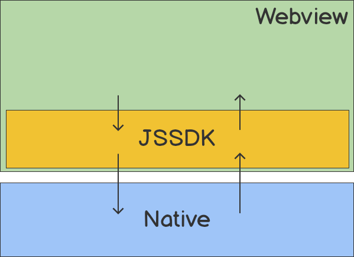
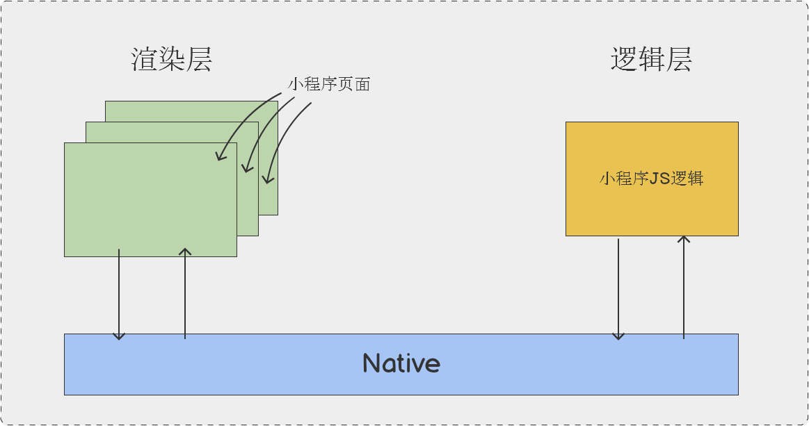
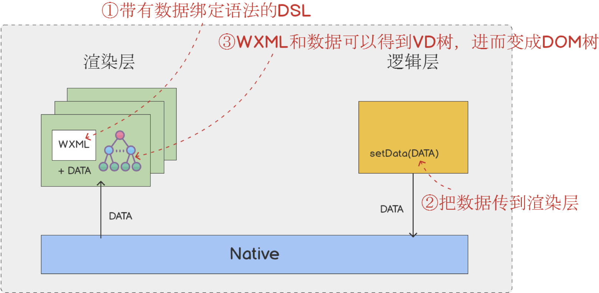
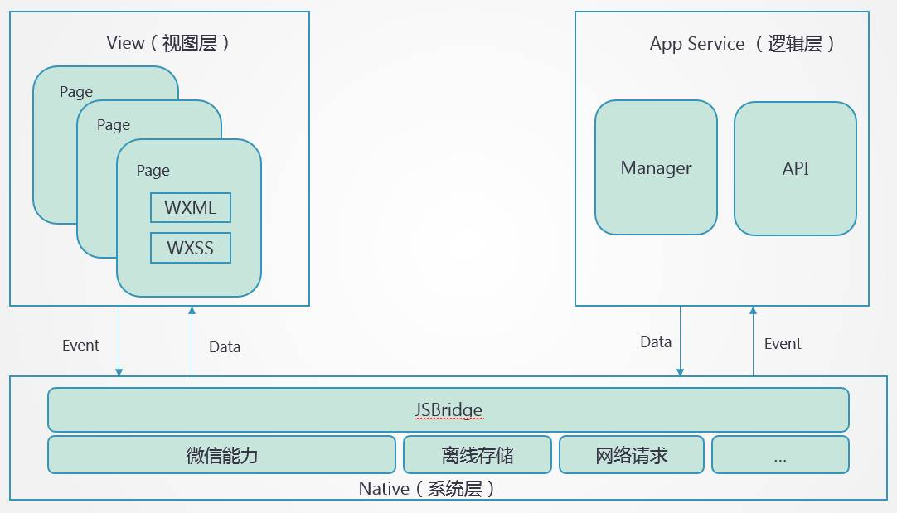

小程序是一种不需要下载安装即可使用的应用，是一种为了解决 WebView 存在的问题而出现的解决方案，本质上还是 Web 网页。

目前，除了微信小程序，还有百度、支付宝、抖音、快应用等类小程序方案，由每个平台自己开发，并且都有一些对于平台的针对性和单独的特点。

## 背景

最初，移动 web 主要有两个入口，一个是移动端的浏览器 app，一个是其他 app 中嵌套的 WebView，相当于是一个阉割版的浏览器，功能比常规浏览器会少一些。

当微信中的 WebView 逐渐成为移动 Web 的⼀个重要⼊⼝时，微信为了增强移动 web 的能⼒，将一些原生 APP 的功能封装成一个开发工具包 JS-SDK，并暴露给开发者，其中包括拍摄、录音、语音识别、二维码、地图、支付、分享、卡券等几十个 API。这样的话，之前原生 APP 才能使用的一些功能，现在通过 js 就能调用。

然而在这些功能之外，JS-SDK 并不能解决 WebView 在体验上的一些其他问题，比如初始化时长时间白屏、页面切换生硬、点击页面反应迟钝等。所以微信开始考虑做一个系统，能在更深入的层面去解决或者优化这些问题。

- 方案 1：React Native
  - 过度依赖客户端
  - 版权问题
- 方案 2：Hybird
  - 把 H5 所有代码打包，一次性 Load 到本地再打开
  - 近似 web 的开发方式
  - 可以做到云端更新

Hybird 带来的问题：

Q：离线包内的代码不好管控，DOM API 太多，跳转外链、操作界面、动态运行脚本等不好控制。   
A：采用双线程，渲染层 (WebView) 和逻辑层 (JDCore) 分离。不使用 HTML，自己封装一套 XML 代码。

Q：双线程的话，页面变化如何实现？   
A：数据驱动。WXML 实现双向绑定语法，逻辑层提供了 setData 等 API，使用 Virtual DOM 进行 diff。

数据通信、API、VD 算法等这些功能封装起来就是**基础库**。

:::tip 吐槽
技术角度来讲：就是一个魔改版的不开放的套壳 Web，且一整套流程全部闭环，IDE-编程语言-API-运行环境-审核，全部自己掌控；

商业角度来讲：巨头们创建封闭生态、掌控私有流量的工具而已。
:::

## 与普通网页开发的区别

|          | 普通网页                                | 小程序                                                        |
| -------- | --------------------------------------- | ------------------------------------------------------------- |
| 开发环境 | 浏览器、IDE                             | 申请账号、开发者工具、配置项目                                |
| 开发语言 | HTML、CSS、JS                           | WXML、CSS、JS                                                 |
| 运行环境 | PC 浏览器、移动浏览器、各种 WebView     | 安卓和 IOS 的 WebView、开发者工具                             |
| 渲染机制 | 渲染线程+脚本线程，互斥，脚本会阻塞解析 | 逻辑层、渲染层分开，没有 DOM、BOM； JSCore 无法运行 npm 包 |
| 发布流程 | 直接放服务器                            | 体积限制，需要审核                                            |

## 架构

## 常用框架

todo

## 参考

- [小程序架构设计](https://developers.weixin.qq.com/community/develop/article/doc/000a4c1620c188f3adf7db9ab5b413)
- [微信，支付宝小程序实现原理概述](https://segmentfault.com/a/1190000018631528)
- [支付宝小程序技术架构全解析](https://www.infoq.cn/article/ulletz7q_ue4duptkgkc)