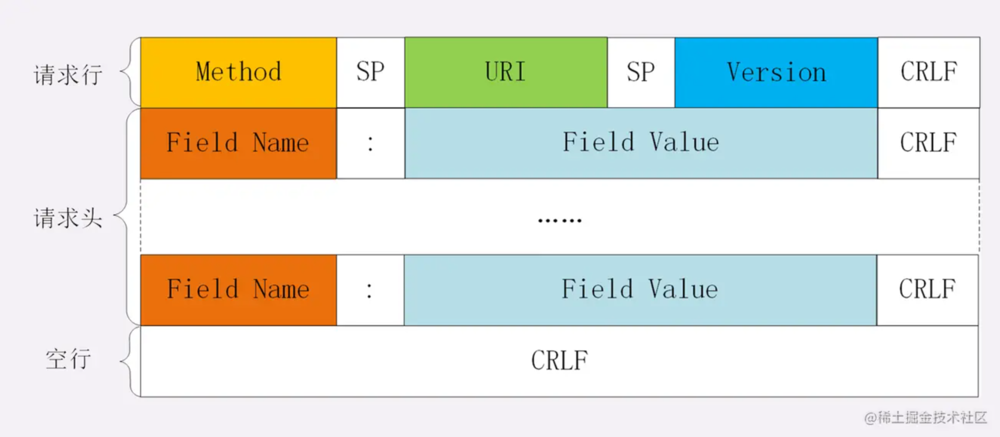
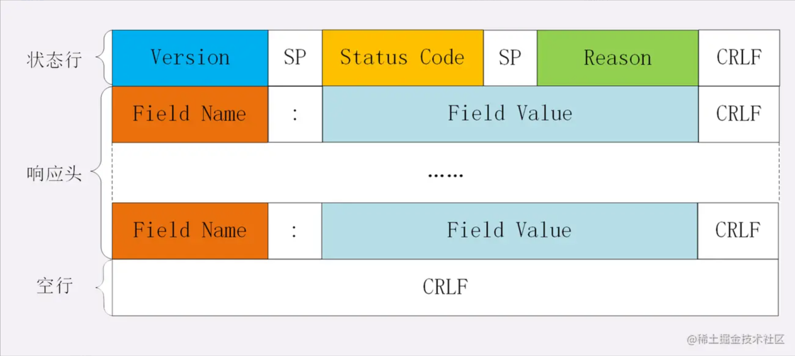

## http 消息结构

### request

- 请求行 (request line)
- 请求头 (header)
- 空行
- 请求数据



**Request Line（请求行）**

- Method：请求方式（大写）
  - GET: 通常用来获取资源
  - HEAD: 获取资源的元信息
  - POST: 提交数据，即上传数据
  - PUT: 修改数据
  - DELETE: 删除资源（几乎用不到）
  - CONNECT: 建立连接隧道，用于代理服务器
  - OPTIONS: 列出可对资源实行的请求方法，用来跨域请求
  - TRACE: 追踪请求-响应的传输路径
- path-to-resource：所请求的资源在 web 服务器上的`路径`。
- HTTP/version-number：HTTP 协议版本号。

**Request Header（请求头）**

请求头部由`关键字：值`对组成，每行一对，关键字和值用英文冒号`:`分隔。请求头部通知服务器有关于客户端请求的信息，典型的请求头有：

*   User-Agent：产生请求的客户端类型；
*   Accept：客户端可识别的响应内容类型列表；
*   Accept-Charset：可接受的应答的字符集；
*   Accept-Encoding：客户端可接受的编码压缩格式；
*   Accept-Language：客户端可接受的自然语言；
*   Host：请求的主机名，允许多个域名同处一个 IP 地址，即虚拟主机；
*   connection：连接方式（close 或 keep alive）；
*   Cookie：存储于客户端扩展字段，向同一域名的服务端发送属于该域的 cookie；

**Request Body（请求数据）**

请求包体不在 GET 方法中使用，而是在 POST 方法中使用。

最常使用的是包体类型 Content-Type 和包体长度 Content-Length；

**示例：**

```
POST / HTTP1.1
Host: www.wrox.com
User-Agent: Mozilla/4.0 (compatible; MSIE 6.0; Windows NT 5.1; SV1; .NET CLR 2.0.50727; .NET CLR 3.0.04506.648; .NET CLR 3.5.21022)
Content-Type: application/x-www-form-urlencoded
Content-Length: 40
Connection: Keep-Alive

name=Professional%20Ajax&publisher=Wiley
```

### Response

- 状态行
- 响应头
- 空行
- 响应正文



**Response Line**

* HTTP/version-number：HTTP 协议版本号。
* status-code：状态码，反应服务器处理是否正常，告知出现的错误。由三位数字组成，第一位数字表示响应的类型，常用的状态码有五大类：
  * 1xx：表示服务器已接收了客户端请求，客户端可继续发送请求；
  * 2xx：表示服务器已成功接收到请求并进行处理；
  * 3xx：表示服务器要求客户端重定向；
  * 4xx：表示客户端的请求有非法内容；
  * 5xx：表示服务器未能正常处理客户端的请求而出现意外错误；
* message：状态码描述文本，同状态码对应。

更多可参考下面的 [常见状态码](#常见状态码)

**Response Header**

从服务器端向客户端返回响应报文时使用的首部。补充了响应的附
加内容，也会要求客户端附加额外的内容信息。

**响应包体**

服务器返回给客户端的文本信息；

**示例：**

```
HTTP/1.1 200 OK
Date: Fri, 22 May 2009 06:07:21 GMT
Content-Type: text/html; charset=UTF-8

<html>
  <head></head>
  <body>
    <!--body goes here-->
  </body>
</html>
```

### GET 和 POST 区别

**数据存放位置**

- GET：将数据拼接在 URL 之后。
- POST：数据放在 Request Body 中。

**数据大小限制**

- GET：所提交数据的大小有限制（因为客户端对 URL 的长度有限制）。
- POST：没有限制。

**安全性**

- GET：所提交的数据以明文的形式显示在 URL 上。
- POST：由于保存在 Request Body 中，增加了安全系数。

**缓存**

- GET：缓存服务器返回的响应。
- POST：不缓存。

## 常见状态码

- 1xx：服务器已接收了客户端请求，客户端可继续发送请求；
  - 101 Switching Protocols。在 HTTP 升级为 WebSocket 的时候，如果服务器同意变更，就会发送状态码 101。
- 2xx：服务器已成功接收到请求，并进行处理；
  - 200 OK 是见得最多的成功状态码。通常在响应体中放有数据。
  - 204 No Content 含义与 200 相同，但响应头后没有 body 数据。
  - 206 Partial Content 顾名思义，表示部分内容。使用场景为 HTTP 分块下载和断点续传，当然也会带上相应的响应头字段 Content-Range。
- 3xx：服务器要求客户端重定向；
  - 301 Moved Permanently 即永久重定向
  - 302 Found，即临时重定向
- 4xx：客户端的请求有非法内容；
  - 401 Unauthorized：未认证
  - 403 Forbidden: 服务器禁止访问
  - 404 Not Found: 资源未找到，服务器上没有对应的资源。
  - 405 Method Not Allowed: 请求方法不被服务器端允许。
- 5xx：服务器出错；
  - 500 Internal Server Error: 仅仅告诉你服务器出错了，出了啥错咱也不知道。
  - 502 Bad Gateway: 服务器自身是正常的，但访问的时候出错了，啥错误咱也不知道。
  - 503 Service Unavailable: 服务器停机或超载，无法响应。

## HTTP 无状态性

HTTP 协议是无状态的（stateless）。也就是说，同一个客户端第二次访问同一个服务器上的页面时，服务器无法知道这个客户端曾经访问过，服务器也无法分辨不同的客户端。HTTP 的无状态特性简化了服务器的设计，使服务器更容易支持大量并发的 HTTP 请求。

打开一个网页需要客户端发送很多次 Request

1. 当你在客户端输入 URL `HTTP://www.cnblogs.com`的时候，客户端发送一个 Request 去获取`HTTP://www.cnblogs.com`的 html，服务器把 Response 发送回客户端
2. 客户端分析 Request 中的 HTML, 发现其中引用了很多其他文件：图片，css 文件，js 文件。
3. 客户端会自动再次发送 Request 去获取图片、css 文件，或者 js 文件
4. 等所有的文件都成功下载后，网页就被显示出来了。

## 理解 HTTP 通讯方式

*   客户端和服务器的通讯是`有来有回`的，而且总是以`客户端首先发起请求`，`服务器进行响应`的形式发生。
*   所谓通讯就是`传输数据`，根据`数据的大小`，可以将其分为三种类型：（c 表示客户端；s 表示服务器）
    *   `c 小：s 小`，适用方法 GET / POST。
    *   `c 小：s 大`，适用方法 GET / POST。
    *   `c 大：s 小`，适用方法 POST。
*   注意，对于客户端来说，不管是上传还是下载`大数据`，都需要解决`内存管理问题`。

## HTTP 首部字段

分为四类：

- **通用**：请求和响应都会使用；
- **请求首部字段**：仅请求报文使用。补充了请求的附加内容、客户端信息、响应内容相关优先级等信息。
- **响应首部字段**：仅响应报文使用。补充了响应的附加内容，也会要求客户端附加额外的内容信息。
- **实体首部字段**：请求和响应的 body 部分使用。与 body 有关的信息。

### 通用

- Cache-Control：缓存相关
- Data：表明创建 HTTP 报文的日期和时间
- Transfer-Encoding：规定了传输报文主体时采用的编码方式。

### 请求首部字段

- Accept：客户端能够处理的媒体类型及媒体类型的相对优先级
  - text（文本）： text/html, text/plain, text/css 等
  - image（图片）: image/gif, image/jpeg, image/png 等
  - audio/video（音视频）: audio/mpeg, video/mp4 等
  - application（二进制）: application/json, application/javascript, application/pdf
- Accept-Charset：客户端支持的字符集及字符集的相对优先顺序
- Accept-Encoding：客户端支持的内容编码及内容编码的优先级顺序
- Accept-Language：客户端能够处理的自然语言集（指中文或英文等），以及自然语言集的相对优先级
- Authorization：客户端的认证信息
- Host：请求的资源所处的互联网主机名和端口号
- Range：只获取资源的一部分
- User-Agent：客户端信息

### 响应首部字段

- Accept-Ranges：是否允许客户端只获取资源的一部分

### 实体首部字段

- Allow：服务端支持的请求方法
- Content-Encoding：body 部分的编码方式
- Content-Language：body 使用的自然语言
- Content-Length：body 部分大小（字节）
- Content-Type：body 媒体类型，值与 Accept 一样
- Expires：缓存失效日期
- Last-Modified：资源最终修改时间

## 非 HTTP/1.1 首部字段

- Set-Cookie
  - 响应报文首部
  - expires=DATE：有效期
  - path=PATH：文件目录
  - domain=域名：域名。
  - HttpOnly：cookie 是否能被 JS 访问
  - Domain 和 Path 标识定义了 Cookie 的作用域
- Cookie
  - 请求报文首部
  - 形式：key=value

## HTTPS

http 的缺点

- 通信使用明文（不加密），内容可能会被窃听
- 不验证通信方的身份，因此有可能遭遇伪装
- 无法证明报文的完整性，所以有可能已遭篡改

https

首次非对称加密，之后全是对称加密。

## 参考

- [HTTP 灵魂之问，巩固你的 HTTP 知识体系](https://juejin.cn/post/6844904100035821575)