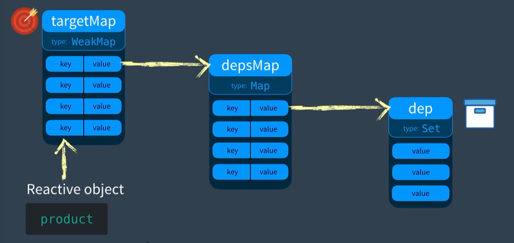

三个核心模块：

- 响应式 (Reactivity)
- 模板编译 (Complier)
- 渲染 (Renderer)

Reactivity 模块允许我们创建响应式的对象，将使用对象的依赖保存起来，并且观察对象的变化，当对象发生变化时，运行刚刚保存起来的依赖。JS 中有两种方法可以监测对象的变化：Object.defineProperty 和 Proxy。

Complier 模块可以识别 HTML 模板 (template)，将其编译为渲染函数 (Render Function)，这个过程一般是发生在编译打包阶段。

Renderer 模块负责将不同组件渲染在页面上，可分成三个阶段：渲染、挂载、补丁。

- 渲染 (Render)
  - 调用 Render Function，返回 virtual DOM node(VNode)；
- 挂载 (Mount)
  - VNode 转成 DOM 元素，渲染页面；
- 补丁 (Patch)
  - 生成新的 VNode，与旧的 VNode 比较，只更新变化的部分。

## Vue 2

vue 2 使用 Object.defineProperty 方法通过定义对象的 getter 和 setter 来监测对象的变化，并且收集使用了这个对象的依赖，对象发生变化时，通知各个依赖进行更新。（观察者模式）

> 观察者模式：定义了一种一对多的依赖关系，即当一个对象的状态发生改变的时候，所有依赖于它的对象都会得到通知并自动更新。


_图 01_

可以通过创建一个简单的响应式来了解 vue 内部的工作机制：

比方说我们现在有一个对象 data：

```js
let data = { price: 5, num: 2 }
```

还有一个计算总和的函数 total：

```js
function total () {
  return data.price * data.num
}
```

什么是响应式？在修改 price 属性的时候，total 函数能自动执行帮我们计算出总和就是响应式！

在原生 JavaScript 中这是无法实现的，想要达到效果，我们必须手动的去调用 total 函数。这是因为，在 JavaScript 中，每个属性都是由特性来描述的，当我们修改 price 属性时，实际是调用了 price 的 set 特性。在原生 JavaScript 中，set 特性只是去修改了 price 的值，并没有做其他的事情。

如果想在调用 set 特性时去做一些其他的事情（比如调用 total 函数），可以使用 Object.defineProperty 来修改默认的 set 特性。

```js
Object.defineProperty(data, 'price', {
  set (newVal) {
    data.price = newVal
    total()
  }
})
```

此时如果再去修改 price，JavaScript 就会自动的帮我们计算总和！

但是我们可能不止要执行 total 这一个函数，所以我们声明一个数组，把要执行的函数存起来，调用 set 的时候挨个执行就好了！就叫他 dependencies 吧，简称 dep。

```js
class Dep () {
  constructor () {
    // 存到这个里边
    this.subs = []
  }
  // 记录要执行的函数 target
  depend () {
    if (target && !this.subs.includes(target)) {
      this.subs.push(target)
    }
  }
  // 挨个执行
  notify () {
    this.subs.forEach(sub => sub())
  }
}
```

现在我们完整的把 data 对象处理一遍：

```js
let data = { price: 5, num: 2 }
let dep = new Dep()
let target

function total () => data.price * data.num

function watcher (fn) {
  target = fn
  target()
  target = null
}

watcher(total)

Object.keys(data).forEach(key => {
  Object.defineProperty(data, key, {
    get () {
      // 函数存起来
      dep.depend()
      return data[key]
    }
    set (newVal) {
      if (newVal === val) return
      data[key] = newVal
      // 函数执行
      dep.notify()
    }
  })
})

console.log(total) // 10
data.price = 10
console.log(total) // 20
```

至此，一个简单的响应式就实现了！我们继续。

响应式创建完毕后，vue 会将 template 部分编译成 render function，返回一个 virtual DOM（通过 json 对象来描述的 DOM 对象），然后转换成真实的 DOM 并渲染。

## Vue 3

vue 3 中监测对象属性的变化使用的是 proxy，原理类似，也是将使用了同一状态的依赖记录下来，状态改变时通知依赖更新，只不过监测状态（对象属性）和记录依赖的方式不太一样。

还以上面的代码为例：

```js
let data = { price: 5, num: 2 }
let total = 0

// total 函数更名为 effect
// 代表所有要触发的动作
function effect () {
  total = data.price * data.num
}
```

与 2.x 不同的是，effect 被保存到了一个 Set 实例中，而不是一个数组。而且它也不再存在于 Dep 类中，Dep 类被拆分成 dep 变量、track 函数和 trigger 函数。变量保存 effects，track 记录依赖，trigger 通知依赖。

```js
let data = { price: 5, num: 2 }
let total = 0

let dep = new Set()
let effect =  () => { total = data.price * data.num }

function track () => { dep.add(effect) }
function trigger () => { dep.forEach(effect => effect()) }

track()
effect()
```

对象、属性和 effect，是一对多的关系。我们会有多个响应式对象，每个对象有多个属性，而每个属性又有多个 effect。如下图：



```js
const targetMap = new WeakMap()

function track (target, key) {
  let depsMap = targetMap.get(target)
  if (!depsMap) {
    targetMap.set(target, (depsMap = new Map()))
  }
  let dep = depsMap.get(key)
  if (!dep) {
    depsMap.set(key, (dep => new Set()))
  }
  // 记录依赖
  dep.add(effect)
}

function trigger (target, key) {
  let depsMap = targetMap.get(target)
  if (!depsMap) return
  let dep = depsMap.get(key)
  if (dep) {
    // 通知依赖
    deps.forEach(effect => effect())
  }
}

let data = { price: 5, num: 2 }
let total = 0
let effect =  () => { total = data.price * data.num }

// 首次执行，记录依赖
track(data, 'price')
effect()

console.log(total) // 10
data.price = 20
trigger(data, 'price')
console.log(total) // 40
```

此时我们依然需要手动执行 track、trigger，实现了手动实现响应式😄，接下来我们需要关注的是如何使用 proxy 监测 data 对象的变化。

vue 2 中我们使用 Object.defineProperty 来修改对象的 get、set 方法，而 proxy 可以返回一个对象的代理，来对目标实现拦截和自定义。我们通过对代理对象的修改，实现对属性变化的监测。

```js
const p = new Proxy(target, { // 自定义的代码 })
```

其实使用 proxy，依然是修改属性的 get、set 特性。

```js
function reactive (target) {
  const handler = {
    get (target, key, receiver) {
      // proxy 内部需要使用 Reflect 来访问原对象的属性
      let result = Reflect.get(target, key, receiver)
      // 记录依赖
      track(target, key)
      return result
    },
    set (target, key, value, receiver) {
      let oldVal = target[key]
      // 同样需要使用 Reflect 来设置原对象的属性
      let result = Reflect.set(target, key, value, receiver)
      if (oldVal !== result) {
        // 通知依赖
        trigger(target, key)
      }
      return result
    }
  }
  return new Proxy(target, handler)
}
```

如此一来，我们只要使用 reactive 函数处理一下 data 对象，我们就得到了一个响应式的对象！

```js
const product = reactive(data)

console.log(total) // 10
data.price = 20
//  不再调用 trigger
console.log(total) // 40
```

## 参考

- [vue mastery - advanced](https://www.vuemastery.com/courses-path/advanced)