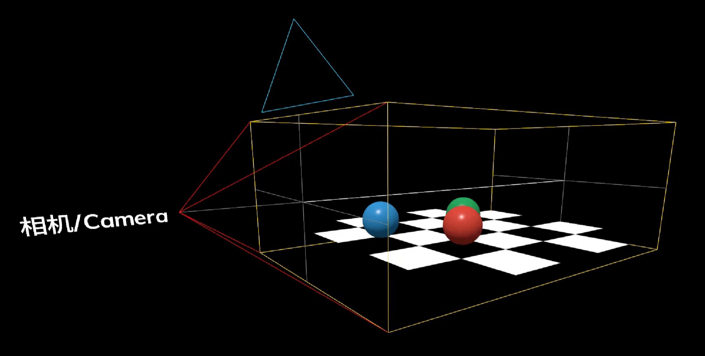

## 历史

之前的三维程序都是运行在 OpenGL 和微软公司的 DirectX 上的，PC 端大型游戏都是在此基础上开发的。随着移动技术的发展，手机上有了许多使用三维程序的场景，所以 OpenGL 标准委员会就在之前的 OpenGL 基础上开发了一个缩减版的 OpenGL 叫做 OpenGL ES，目前智能手机操作系统都是基于 OpenGL ES 来开发三维程序的。

同时为了能在浏览器上运行三维程序，就在 OpenGL ES 2.0 的基础上开发出了 WebGL 标准，把 JavaScript 和 OpenGL ES 2.0 绑定起来。WebGL 可以为 HTML5-Canvas 提供硬件 3D 加速渲染，这样 Web 开发人员就可以借助系统显卡来在浏览器里更流畅的展示 3D 场景和模型了。

WebGL 的功能很强大，但是还是偏底层，开发时非常复杂且容易出错，Three.js 就是把 WebGL 包装了一层，可以让我们方便快速的实现常见功能。

Three.js 常见功能：

- 创建简单和复杂的三维几何图像
- 在三维场景下创建和移动物体
- 为物体添加纹理和材质
- 使用各种光源来装饰场景
- 加载三维软件所创建的模型
- 使用自定义的着色器
- 创建虚拟现实 (VR) 和增强现实 (AR) 场景
- 为三维场景添加高级的后期处理效果
- 创建点云（粒子系统）

Three.js 优缺点：

- Three.js 擅长 WebGL 场景渲染，作为 JS 类库特别原生、灵活、自由度高。
- Three.js 不擅长物理碰撞，因此不适合开发 3D 游戏。

<!-- ## Canvas 元素

todo

https://stackoverflow.com/questions/15558418/how-do-you-save-an-image-from-a-three-js-canvas -->

## 核心知识分类

使用 Three.js 开发 3D 程序需要两方面的核心知识：

- 3D 美术知识：相机、光源、mesh、geomerty、material 等等，这些知识不止在 3D 程序中会用到，建模等场景也会使用，基础美术能力决定了你对 3D 的了解。计算机图形学也是用的这一套，可能会加入一些数学方面的知识。
- JS 编程能力：知道如何使用 JS 进行面向对象编程，构建程序的时候，如何做到清晰的模块化，代码该如何组织，数据和视图如何绑定等等。

## 技术关键词

_Three.JS Walking Map 来源： http://ushiroad.com/3j/_

上面这张图介绍了 Three.js 中的几个关键对象以及大概的渲染流程，大家可以进网站看一下，右侧流程中带边框的单词是有交互的。

### 场景 (Scene)

场景能够让你在什么地方、摆放什么东西来交给 three.js 来渲染，这是你放置物体、灯光和摄像机的地方。

Scene 类的继承关系：

- Object3D
  - Scene（场景）
  - Fog（线性雾 - 雾的密度是随着距离线性增大）
  - FogExp2（指数雾 - 雾的密度是随着距离指数性增大）

### 相机 (Camera)

场景中的相机，代替人眼去观察，场景中只能添加一个。

Camera 类的继承关系：

- Camera（基类）
  - OrthographicCamera（正交相机 - 大小与距离无关）
  - PerspectiveCamera（透视相机 - 近大远小）
    - ArrayCamera（相机阵列 - 一组相机）
- CubeCamera（立方相机）
- StereoCamera（双透视相机）

**视锥 (ViewFrustum)**

我们在创建相机的时候，需要定义一个**视锥 (ViewFrustum)**，随后在渲染的时候，计算机会将视锥内的所有物体进行渲染，视锥外的则不会渲染。

_ViewFrustum 来源：https://vispy.org/getting_started/modern-gl.html#transformations_

**透视相机 (PerspectiveCamera)**

模拟人眼，近大远小，更适合 3D 渲染；

**正交相机 (OrthographicCamera)**

物体尺寸与镜头远近无关，主要被应用在 CAD 等这种需要精确测量物体尺寸的应用场景中；

正交相机的视锥是一个长方体：

### 物体对象

包括二维物体（点、线、面）、三维物体，模型等等。three.js 中有多种方式来创建物体对象，下面是创建方式的简单介绍和构造类之间的继承关系：

- Object3D（基类）
  - Group（与 Object3D 类似）
  - Points（点）
  - Line（线）
    - LineLoop（头尾相接的线）
    - LineSegments（线段 - 点与点之间的线）
  - Bone（骨骼）
  - Mesh（网格对象 - 以三角形网格覆盖表面组成的物体，最为常用）
    - SkinnedMesh（蒙皮网格 - 具有 Skeleton 和 bones 的网格）
    - InstancedMesh（实例化网格 - 特殊版本的 Mesh，用来渲染大量具有相同几何体与材质、但具有不同世界变换的物体）
  - LOD（Levels of Detail，多层次细节 - 根据远近自动调节网格的疏密程度）
- Skeleton（骨架 - Bones 数组组合成骨架）
- Sprite（精灵 - 一个总是面朝着摄像机的平面）

**网格 (Mesh)**

在上面的方法中，Mesh 是最为常用的构建物体的方式。

什么是 Mesh？在计算机的世界里，一条弧线是由有限个点构成的有限条线段连接得到的。当线段数量越多，长度就越短，当达到你无法察觉这是线段时，一条平滑的弧线就出现了。 计算机的三维模型也是类似的。只不过线段变成了平面，空间中确定一个平面最少需要三个点，所以普遍用三角形组成的网格来描述。我们把这种模型称之为**网格 (Mesh) 模型**。

_计算机图形学中著名的斯坦福兔子_

在 three.js 中，网格 (Mesh) = 几何体 (Geometry) + 材质 (Material) 。

网格包含的内容为：几何体、几何体的材质、几何体的自身网格坐标体系。

同一个材质和几何体可以被多个网格对象使用。

一个场景可以同时添加多个网格。

**几何体 (Geometry)**

顾名思义，几何体用来表现物体的**形状**。例如 球体、立方体、平面、以及自定义的几何体（汽车、动物、房子、数目等）。

在 Three.js 中，一个几何体的来源有 3 个：

- Three.js 中内置的一些基本几何体
- 自己创建自定义的几何体
- 通过文件加载进来的几何体

three.js 中内置了许多基本的几何图元 (Primitives)，命名全部以`Geometry`结尾，我们可以使用这些图元快速创建常见的 Geometry。

Geometry 类的继承关系：

- BufferGeometry（基类）
  - ShapeGeometry（形状）
  - CircleGeometry（圆形）
  - RingGeometry（圆环）
  - PlaneGeometry（平面）
  - BoxGeometry（立方体）
  - CylinderGeometry（圆柱体）
    - ConeGeometry（圆锥体）
  - PolyhedronGeometry（多面体）
    - TetrahedronGeometry（四面体）
    - OctahedronGeometry（八面体）
    - DodecahedronGeometry（十二面体）
  - SphereGeometry（球体）
  - TorusGeometry（圆环体）
  - TorusKnotGeometry（圆环打结体）
  - TubeGeometry（管道几何体）
  - EdgesGeometry（边缘）
  - ExtrudeGeometry（拉伸几何体 - 二维图像 Z 轴拉伸生成三维图形）
    - TextGeometry（文本几何体 - 将文字生成为几何体）
  - LatheGeometry（车削）
  - WireframeGeometry（网格几何体）
  - ConvexGeometry（凸点几何体 - 根据给出的点生成图片几何体）
  - DecalGeometry（贴花几何体）
  - ParametricGeometry（参数几何体 - 生成由参数表示其表面的几何体）

**材质 (Material)**

Material 代表三维物体的材质，材质表示的是物体对光照的反应，表示除了形状以外所有可视属性的集合，例如色彩、纹理、光滑度、透明度、反射率、折射率、发光度等。

同样的，three.js 中内置了一些常用的材质函数。

Material 类的继承关系：

- Material（基类）
  - PointsMaterial（点）
  - LineBasicMaterial（实线）
  - LineDashedMaterial（虚线）
  - MeshBasicMaterial（基础网格 - 不受光照影响，显示材质本身的颜色）
  - MeshDepthMaterial（深度网格 - 近浅远深）
  - MeshDistanceMaterial（距离网格 - 内部使用点光源来实现阴影映射）
  - MeshLambertMaterial（Lambert 网格 - 非镜面高光）
  - MeshPhongMaterial（Phong 网格 - 镜面高光）
  - MeshMatcapMaterial（材质捕捉网格 - 不对灯光作出反应）
  - MeshNormalMaterial（法线网格）
  - MeshStandardMaterial（标准网格 - 逼真，耗性能）
    - MeshPhysicalMaterial（物理网格 - 更复杂的着色器功能，更耗性能）
  - MeshToonMaterial（卡通网格 - 卡通效果）
  - ShaderMaterial（着色器材质 - 自定义材质）
    - RawShaderMaterial（原始着色器材质）
  - ShadowMaterial（阴影材质）
  - SpriteMaterial（点精灵材质 - 一种使用 Sprite 物体的材质）

**纹理 (Texture)**

纹理可以简单理解为一种图像或一张图片，用来包裹到几何体表面上。

纹理来源可以是：

- 通过文件加载进来
- 在画布上生成
- 由另外一个场景渲染出

Texture 类的继承关系：

- Texture（基类）
  - CanvasTexture（Canvas 纹理）
  - CompressedTexture（压缩的纹理 - 基于被压缩的数据创建纹理）
  - CubeTexture（立方纹理 - 六张图片组成的纹理对象）
  - Data3DTexture（三维纹理贴图 - 仅支持 WebGL 2.0）
  - DataArrayTexture（DataArrayTexture - 仅支持 WebGL 2.0）
  - DataTexture（DataArrayTexture - 仅支持 WebGL 2.0）
  - DepthTexture（自动将渲染的深度信息保存到纹理中）
  - VideoTexture（视频纹理）
  - Source（表示纹理的数据源）
  - FramebufferTexture

### 光源 (Light)

场景中的光照，如果不添加光照场景将会是一片漆黑。

Light 类的继承关系：

- Light（基类）
  - AmbientLight（环境光）
  - DirectionalLight（平行光）
  - HemisphereLight（半球光）
  - PointLight（点光源）
  - RectAreaLight（平面光）
  - SpotLight（聚光灯）
  - LightProbe（光照探针）
    - AmbientLightProbe（环境光探针）
    - HemisphereLightProbe（半球光探针）

### 渲染器 (Renderer)

场景的渲染方式，如 webGL\canvas2D\Css3D，webGL 最常用。

Renderer 类继承关系：

- WebGLRenderer（WebGL2.0 渲染器，默认）
- WebGL1Renderer（WebGL1.0 渲染器）
- WebGLRenderTarget（离屏渲染）
  - WebGLCubeRenderTarget（Cube 相机使用的离屏渲染）
  - WebGLMultipleRenderTargets（一个 shader 可以渲染多个纹理）

### 控制器 (Control)

可通过键盘、鼠标控制相机的移动。

## Three.js 中的其他功能

### 加载外部模型

除了自建立方体之外，我们还可以加载外部模型，比如 C4D、3DMax 等创建好的复杂模型。

加载外部模型，是通过 Three.js 加载器 (Loader) 实现的，每个加载器对应某种特定的文件格式。加载器把文本/二进制的模型文件转化为 Three.js 对象结构。 

### 动画

todo

### 粒子

todo

## 参考

- [three.js 入门教程（合集）](https://www.bilibili.com/video/BV1g44y1L7np?spm_id_from=333.337.search-card.all.click)
- [WebGL 技术储备指南](https://juejin.cn/post/6844903425272987662)
- [DirectX 和 OpenGL - 极客湾](https://www.youtube.com/watch?v=3OYNerkxI-U&ab_channel=%E6%9E%81%E5%AE%A2%E6%B9%BEGeekerwan)
- [快速上手 Three.js - 奇乐编程学院](https://www.bilibili.com/video/BV1zU4y1L7Go?spm_id_from=333.999.0.0)
- [puxiao - Github](https://github.com/puxiao/threejs-tutorial)
- [知乎专栏](https://zhuanlan.zhihu.com/p/27296011)